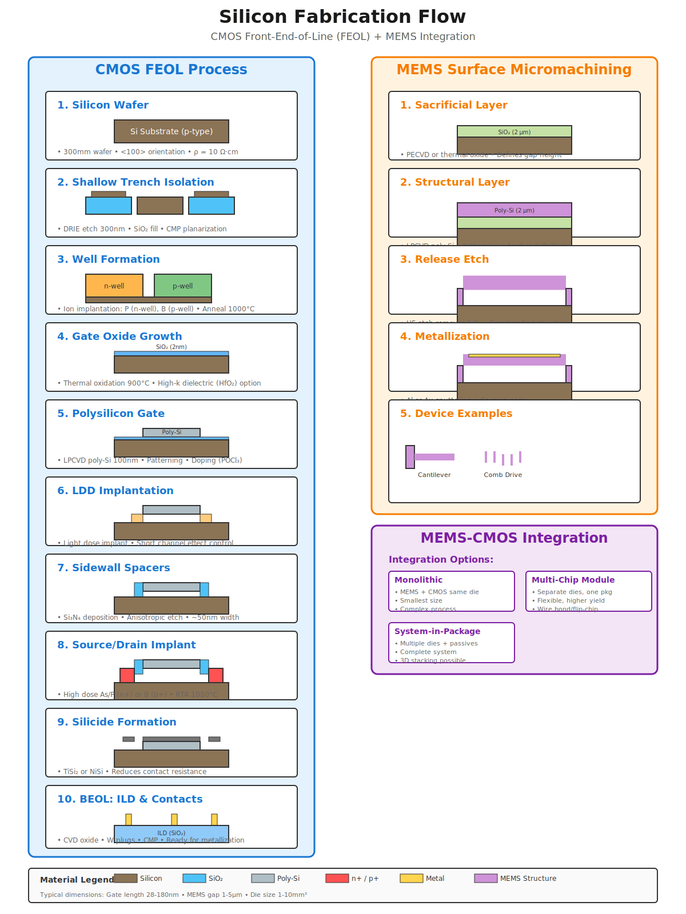

# Fabrication Flow Diagrams

## CMOS & MEMS Fabrication Flow

This diagram shows:
- Complete CMOS FEOL process (10 steps)
- MEMS surface micromachining (5 steps)  
- Integration strategies comparison

### Viewing Options

1. **GitHub**: Click the SVG file above - it renders automatically
2. **Local**: Open in any web browser
3. **Edit**: Import into Draw.io, Inkscape, or Adobe Illustrator

### File Details

- Format: SVG (Scalable Vector Graphics)
- Dimensions: 1200 × 1600 viewBox
- File size: ~15 KB
- License: CC BY 4.0