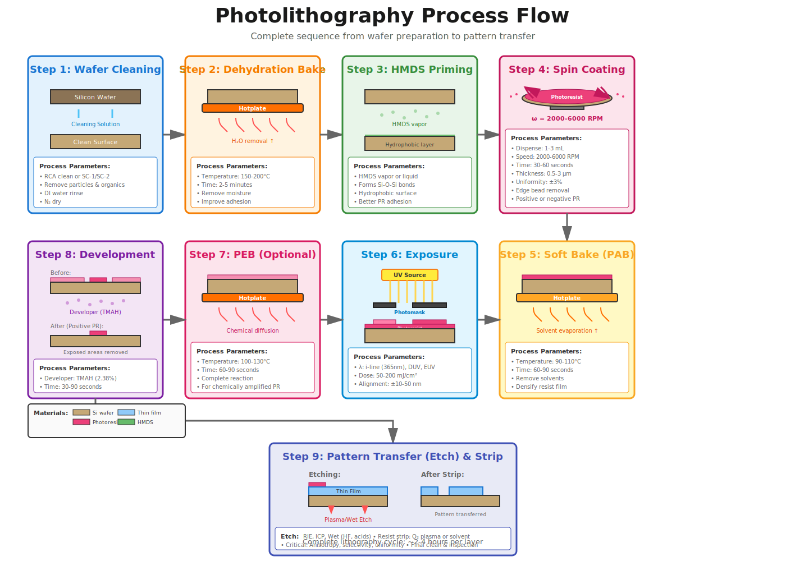
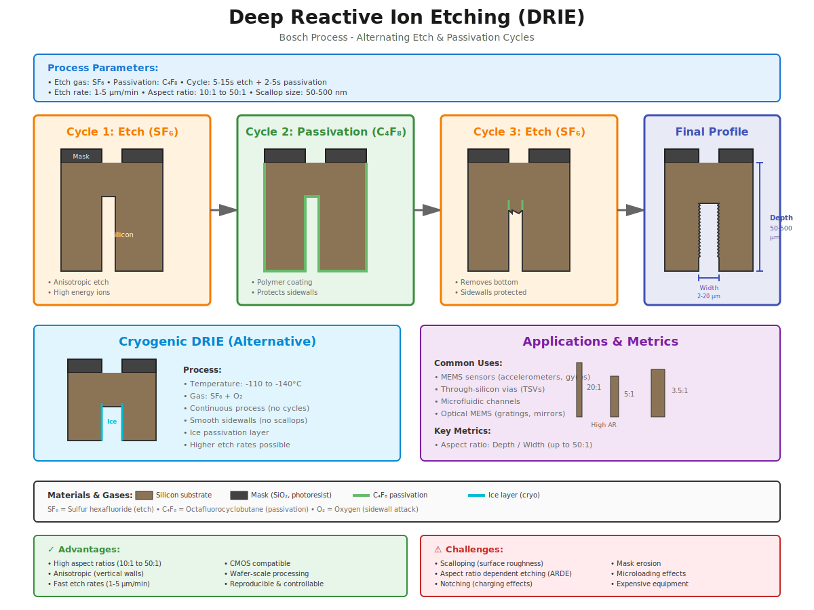
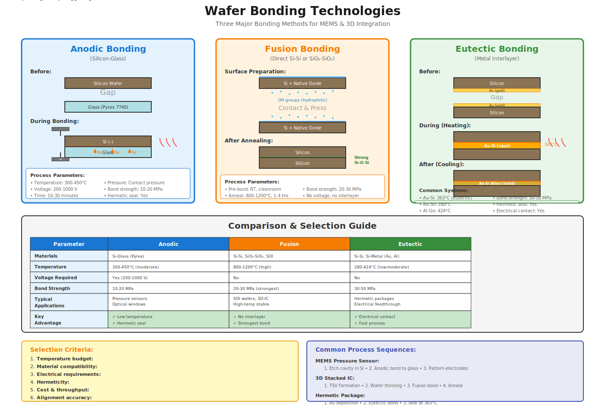
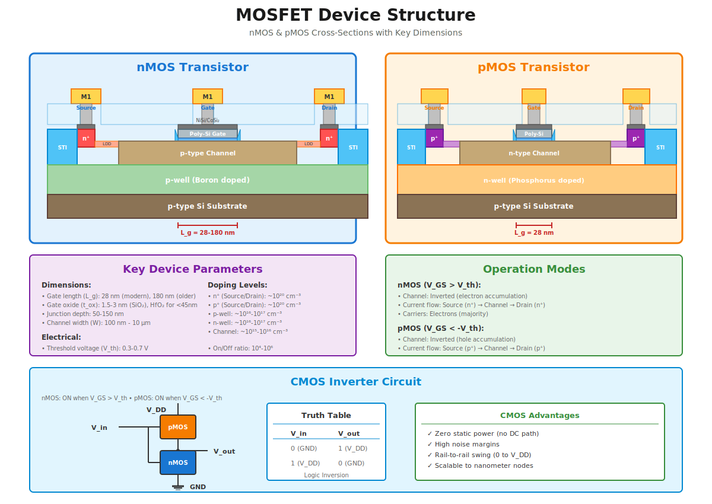

# Diagrams & Visual Aids

This directory contains high-quality SVG diagrams illustrating key concepts in semiconductor fabrication, MEMS processing, and device structures. All diagrams are created in scalable vector format (SVG) for maximum clarity and reusability.

##  Available Diagrams

### 1. [fabrication-flow.svg](./fabrication-flow.svg)
**Complete CMOS & MEMS Fabrication Flow**


**Description**: Comprehensive overview showing the complete fabrication sequence for both CMOS transistors and MEMS devices.

**Contents**:
- CMOS Front-End-of-Line (FEOL) - 10 major steps
  - Silicon wafer preparation
  - Shallow Trench Isolation (STI)
  - Well formation (n-well, p-well)
  - Gate oxide growth
  - Polysilicon gate deposition
  - LDD implantation
  - Sidewall spacers
  - Source/Drain implant
  - Silicide formation
  - BEOL start (ILD & contacts)
- MEMS Surface Micromachining - 5 steps
  - Sacrificial layer deposition
  - Structural layer (poly-Si)
  - Release etch
  - Metallization
  - Device examples (cantilever, comb drive)
- Integration strategies comparison
  - Monolithic integration
  - Multi-Chip Module (MCM)
  - System-in-Package (SiP)

**Use Cases**: 
- Course overview lectures
- Process flow documentation
- Understanding fabrication sequence
- Integration strategy selection

**Dimensions**: 1200 × 1600 px  
**File Size**: ~15 KB

---

### 2. [lithography-steps.svg](./lithography-steps.svg)
**Photolithography Process (9 Steps)**



**Description**: Detailed step-by-step illustration of the photolithography process from wafer cleaning to pattern transfer.

**Contents**:
- Step 1: Wafer Cleaning (RCA clean)
- Step 2: Dehydration Bake (150-200°C)
- Step 3: HMDS Priming (adhesion layer)
- Step 4: Spin Coating (2000-6000 RPM)
- Step 5: Soft Bake/PAB (90-110°C)
- Step 6: UV Exposure (i-line/DUV/EUV)
- Step 7: Post-Exposure Bake (optional, for CAR)
- Step 8: Development (TMAH developer)
- Step 9: Pattern Transfer (etch & strip)

**Process Parameters**:
- Temperature ranges
- Time durations
- Equipment specifications
- Chemical details

**Use Cases**:
- Understanding photolithography sequence
- Process troubleshooting
- Training materials
- Lab protocol development

**Dimensions**: 1200 × 800 px  
**File Size**: ~12 KB

---

### 3. [drie-cross-section.svg](./drie-cross-section.svg)
**Deep Reactive Ion Etching (DRIE) - Bosch Process**



**Description**: Comprehensive illustration of the DRIE Bosch process showing alternating etch and passivation cycles, plus cryogenic DRIE alternative.

**Contents**:
- Bosch Process Cycles (4 stages shown)
  - Cycle 1: SF₆ etch (anisotropic removal)
  - Cycle 2: C₄F₈ passivation (sidewall protection)
  - Cycle 3: Next etch cycle
  - Final profile with scalloping
- Cryogenic DRIE alternative
  - Ice passivation layer
  - Smooth sidewalls (no scallops)
  - Process parameters
- Applications & metrics
  - MEMS sensors, TSVs, microfluidics
  - Aspect ratio examples (3.5:1 to 20:1)
- Advantages vs. challenges comparison

**Process Parameters**:
- Etch rate: 1-5 µm/min
- Aspect ratio: 10:1 to 50:1
- Scallop size: 50-500 nm
- Gas chemistry: SF₆, C₄F₈, O₂

**Use Cases**:
- MEMS device design
- TSV process development
- Understanding ARDE effects
- Process optimization

**Dimensions**: 1200 × 900 px  
**File Size**: ~14 KB

---

### 4. [wafer-bonding-types.svg](./wafer-bonding-types.svg)
**Wafer Bonding Technologies Comparison**



**Description**: Detailed comparison of three major wafer bonding methods used in MEMS and 3D integration.

**Contents**:

**Anodic Bonding (Si-Glass)**:
- Process: 300-450°C, 200-1000 V
- Na⁺ ion migration visualization
- Bond strength: 10-20 MPa
- Applications: Pressure sensors, optical windows

**Fusion Bonding (Direct Si-Si)**:
- Process: 800-1200°C annealing
- Hydrophilic surface preparation
- Bond strength: 20-30 MPa (strongest)
- Applications: SOI wafers, 3D-IC

**Eutectic Bonding (Metal Interlayer)**:
- Process: Au-Si eutectic at 363°C
- Liquid → solid phase transition
- Bond strength: 30-50 MPa
- Applications: Hermetic packages, electrical feedthrough

**Comparison Table**:
- Materials compatibility
- Temperature requirements
- Voltage needed
- Bond strength
- Applications
- Key advantages

**Selection Criteria**:
- Temperature budget
- Material compatibility
- Electrical requirements
- Hermeticity needs
- Cost & throughput
- Alignment accuracy

**Use Cases**:
- Bonding method selection
- MEMS packaging design
- 3D integration planning
- Process comparison

**Dimensions**: 1400 × 950 px  
**File Size**: ~16 KB

---

### 5. [mosfet-structure.svg](./mosfet-structure.svg)
**MOSFET Device Structure Cross-Section**



**Description**: Detailed cross-sectional views of nMOS and pMOS transistors showing all layers and components, plus CMOS inverter circuit.

**Contents**:

**nMOS Transistor**:
- Complete layer stack (metal to substrate)
- Source/Drain (n⁺), Gate, LDD regions
- STI isolation, p-well
- Gate length: 28-180 nm
- All process layers labeled

**pMOS Transistor**:
- Complementary structure
- Source/Drain (p⁺), n-well
- Modern 28 nm node shown
- Mirror structure to nMOS

**Key Components**:
- Metal contacts (M1)
- Contact plugs (tungsten)
- Silicide (NiSi/CoSi₂)
- Poly-Si gate
- Gate oxide (1.5-3 nm)
- Sidewall spacers (Si₃N₄)
- LDD (Lightly Doped Drain)
- STI (Shallow Trench Isolation)
- Well regions
- Substrate

**Device Parameters**:
- Dimensions (gate length, oxide thickness, junction depth)
- Doping levels (10¹⁵ to 10²⁰ cm⁻³)
- Electrical characteristics (V_th, I_on/I_off)

**CMOS Inverter**:
- Circuit diagram
- Truth table
- Advantages (zero static power, rail-to-rail swing)

**Use Cases**:
- Device physics understanding
- MOSFET operation explanation
- CMOS circuit design
- Technology node comparison

**Dimensions**: 1200 × 850 px  
**File Size**: ~13 KB

---

##  File Format & Usage

### SVG (Scalable Vector Graphics)

All diagrams are provided in SVG format for several reasons:

**Advantages**:
-   **Scalable**: Zoom infinitely without quality loss
-   **Small file size**: Typical 10-20 KB per diagram
-   **Editable**: Can be modified in vector graphics software
-   **Web-friendly**: Renders directly in browsers and GitHub
-   **Print-ready**: High quality at any resolution
-   **Accessible**: Text remains searchable and selectable

### Viewing Options

1. **On GitHub**: Click any SVG file - it renders automatically in your browser
2. **Local Browser**: Open SVG files directly in Chrome, Firefox, Safari, or Edge
3. **Vector Graphics Software**: 
   - Inkscape (free, open-source)
   - Adobe Illustrator
   - CorelDRAW
   - Sketch
   - Figma (import)
4. **Office Software**: Insert into PowerPoint, Word, Google Slides
5. **LaTeX/Overleaf**: Include using `\includegraphics{diagram.svg}`

### Editing Diagrams

**Recommended Tools**:

1. **Inkscape** (Free, Open-Source)
   ```bash
   # Install on Ubuntu/Debian
   sudo apt install inkscape
   
   # Install on macOS
   brew install inkscape
   
   # Windows: Download from inkscape.org
   ```

2. **Draw.io / diagrams.net** (Free, Web-based)
   - Import SVG: File → Import → Select SVG
   - Edit and export back to SVG

3. **Adobe Illustrator** (Commercial)
   - Native SVG support
   - Professional-grade editing

**Basic Editing Workflow**:
```bash
# 1. Clone repository
git clone https://github.com/Zeyad-Mustafa/silicon-fabrication-handbook.git

# 2. Navigate to diagrams
cd silicon-fabrication-handbook/diagrams/

# 3. Open in Inkscape (example)
inkscape fabrication-flow.svg

# 4. Make changes and save

# 5. Commit changes
git add fabrication-flow.svg
git commit -m "Update fabrication flow diagram"
git push origin main
```

---

##  Design Specifications

### Color Palette

All diagrams follow a consistent color scheme:

| Material/Layer | Color | Hex Code |
|----------------|-------|----------|
| Silicon substrate | Brown | `#8b7355` |
| SiO₂ (oxide) | Light blue | `#4fc3f7` |
| Poly-Si | Gray | `#b0bec5` |
| n⁺ doped regions | Red | `#ff5252` |
| p⁺ doped regions | Purple | `#9c27b0` |
| Metal (Al, Cu, Au) | Yellow | `#ffd54f` |
| MEMS structures | Purple | `#ce93d8` |
| n-well | Orange | `#ffb74d` |
| p-well | Green | `#a5d6a7` |
| Photoresist | Pink | `#ec407a` |

### Typography

- **Titles**: Arial/Helvetica, 28-36 pt, Bold
- **Section Headers**: Arial/Helvetica, 18-20 pt, Bold
- **Labels**: Arial/Helvetica, 10-12 pt, Regular
- **Annotations**: Arial/Helvetica, 8-10 pt, Regular

### Dimensions

- **Standard width**: 1200-1400 px
- **Standard height**: 800-1000 px (varies by content)
- **Minimum text size**: 8 pt (for readability)
- **Stroke width**: 1-3 px (depending on element importance)

---

##  Creating New Diagrams

### Guidelines

When creating new diagrams for this collection:

1. **Use SVG format** for scalability
2. **Follow the color palette** for consistency
3. **Include clear labels** for all components
4. **Add dimension annotations** where relevant
5. **Provide process parameters** when applicable
6. **Keep file size under 50 KB** when possible
7. **Use meaningful filenames** (lowercase, hyphens)
8. **Update this README** with new diagram information

### Template Structure

```xml
<?xml version="1.0" encoding="UTF-8"?>
<svg viewBox="0 0 1200 800" xmlns="http://www.w3.org/2000/svg">
  
  <!-- Title -->
  <text x="600" y="35" text-anchor="middle" font-size="28" 
        font-weight="bold" fill="#1a1a1a">
    Your Diagram Title
  </text>
  
  <!-- Your content here -->
  
  <!-- Legend (if needed) -->
  
</svg>
```

### Suggested Future Diagrams

Additional diagrams that would complement this collection:

1. **CMP Process** - Chemical Mechanical Polishing steps
2. **CMOS Inverter Layout** - Top-view mask layers
3. **Ion Implantation** - Dopant profiles and channeling
4. **CVD/PVD Deposition** - Thin film growth mechanisms
5. **Etching Types** - Isotropic vs. anisotropic comparison
6. **MEMS Accelerometer** - Complete device structure
7. **FinFET Structure** - 3D transistor geometry
8. **Package Types** - DIP, QFP, BGA cross-sections
9. **Thermal Oxidation** - Deal-Grove model visualization
10. **Wafer Dicing** - Singulation process steps

---

##  Usage in Education

### For Instructors

These diagrams are designed to be:
- **Lecture-ready**: High resolution for projection
- **Printable**: Vector format ensures quality handouts
- **Customizable**: Edit to match your curriculum
- **License-friendly**: CC BY 4.0 allows modification

**Integration Examples**:
```latex
% LaTeX/Beamer
\begin{frame}{CMOS Fabrication}
  \includegraphics[width=\textwidth]{fabrication-flow.svg}
\end{frame}
```

```markdown
<!-- Markdown/Jupyter

```

### For Students

**Study Tips**:
1. Print diagrams for annotation during study sessions
2. Use as reference while reading textbook chapters
3. Create your own variations to test understanding
4. Compare diagrams to actual fab process documentation

---

##  Contributing

We welcome contributions of new diagrams or improvements to existing ones!

### Contribution Process

1. **Fork the repository**
   ```bash
   git fork https://github.com/Zeyad-Mustafa/silicon-fabrication-handbook
   ```

2. **Create a new branch**
   ```bash
   git checkout -b add-cmp-diagram
   ```

3. **Add your diagram**
   - Follow design guidelines above
   - Create SVG file in `diagrams/` directory
   - Update this README with diagram information

4. **Test rendering**
   - Verify SVG displays correctly in browser
   - Check file size (<50 KB preferred)
   - Validate all labels are readable

5. **Submit pull request**
   - Provide clear description of diagram
   - Mention use cases and target audience
   - Include preview image if possible

### Quality Checklist

Before submitting:
- [ ] SVG file is valid and renders correctly
- [ ] Colors follow the established palette
- [ ] All text is readable (minimum 8 pt)
- [ ] Labels are clear and accurate
- [ ] File size is reasonable (<50 KB)
- [ ] README is updated with diagram description
- [ ] Diagram follows consistent style with existing collection

---

##  Related Resources

### External Diagram Collections

- [Wikimedia Commons - Semiconductor Devices](https://commons.wikimedia.org/wiki/Category:Semiconductor_devices)
- [MEMS Clearinghouse](https://www.memsnet.org/)
- [Semiconductor Manufacturing Guide (PDF)](https://www.semi.org/)

### Software & Tools

- **Inkscape**: https://inkscape.org/
- **Draw.io**: https://www.diagrams.net/
- **SVG Optimization**: https://jakearchibald.github.io/svgomg/
- **Color Palette Generator**: https://coolors.co/

### Further Reading

For context and detailed explanations of the processes shown in these diagrams, refer to the main documentation in the `docs/` directory:

- [CMOS FEOL Processes](../docs/02-cmos-feol/)
- [MEMS Fabrication](../docs/04-mems-surface-micromachining/)
- [Lithography](../docs/02-cmos-feol/lithography.md)
- [Deep RIE](../docs/05-mems-bulk-micromachining/deep-rie.md)
- [Wafer Bonding](../docs/05-mems-bulk-micromachining/wafer-bonding.md)

---

##  License

All diagrams in this directory are licensed under **Creative Commons Attribution 4.0 International (CC BY 4.0)**.

**You are free to**:
-   Share — copy and redistribute the material in any medium or format
-   Adapt — remix, transform, and build upon the material for any purpose, even commercially

**Under the following terms**:
-  Attribution — You must give appropriate credit, provide a link to the license, and indicate if changes were made

Full license text: https://creativecommons.org/licenses/by/4.0/

### Citation

If you use these diagrams in academic work, please cite:

```bibtex
@misc{silicon_fab_diagrams_2025,
  author = {Silicon Fabrication Handbook Contributors},
  title = {Semiconductor Fabrication Process Diagrams},
  year = {2025},
  publisher = {GitHub},
  url = {https://github.com/Zeyad-Mustafa/silicon-fabrication-handbook/tree/main/diagrams}
}
```

---

##  Technical Notes

### SVG Compatibility

All diagrams have been tested with:
-   GitHub (web interface)
-   Chrome 120+
-   Firefox 120+
-   Safari 17+
-   Edge 120+
-   Inkscape 1.3+
-   Adobe Illustrator CC 2024

### File Size Optimization

SVG files are manually optimized to balance quality and size:
- Unnecessary metadata removed
- Precision limited to 2 decimal places
- Whitespace minimized
- Redundant paths merged

For further optimization (if needed):
```bash
# Using SVGO
npm install -g svgo
svgo diagram.svg -o diagram-optimized.svg

# Using Inkscape
inkscape --export-plain-svg=diagram-optimized.svg diagram.svg
```

---

## 📞 Contact & Support

### Questions or Issues?

- **GitHub Issues**: [Report a problem](https://github.com/Zeyad-Mustafa/silicon-fabrication-handbook/issues)
- **Discussions**: [Ask a question](https://github.com/Zeyad-Mustafa/silicon-fabrication-handbook/discussions)
- **Email**: [Contact maintainer](mailto:zeyad.uni@gmail.com)

### Acknowledgments

These diagrams were created as part of the Silicon Fabrication Handbook project, with inspiration from:
- Academic textbooks (Jaeger, Plummer, Campbell)
- Industry documentation (SEMI standards)
- Research publications
- Educational resources from leading universities

---

**Last Updated**: January 2026  
**Version**: 1.0  
**Total Diagrams**: 5  
**Maintained by**: Silicon Fabrication Handbook Team