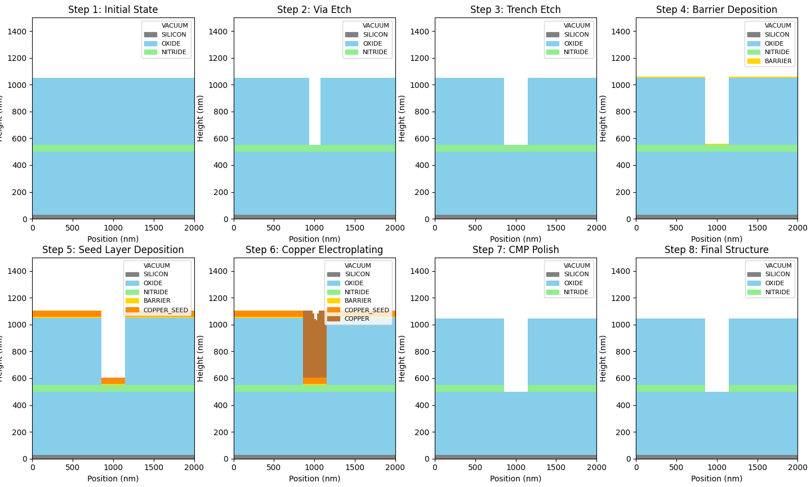

# Damascene Process

## Table of Contents
- [Introduction](#introduction)
  - [Why Damascene?](#why-damascene)
  - [Key Advantages](#key-advantages)
  - [Applications](#applications)
- [Historical Context](#historical-context)
  - [The Copper Transition](#the-copper-transition)
  - [The Damascus Connection](#the-damascus-connection)
- [Process Overview](#process-overview)
  - [Single vs. Dual Damascene](#single-vs-dual-damascene)
  - [Interactive Process Simulator](#interactive-process-simulator)
  - [Process Flow Comparison](#process-flow-comparison)
- [Single Damascene Process](#single-damascene-process)
  - [Via-First Single Damascene](#via-first-single-damascene)
- [Dual Damascene Process](#dual-damascene-process)
  - [Via-First Dual Damascene](#via-first-dual-damascene)
  - [Trench-First Dual Damascene](#trench-first-dual-damascene)
  - [Self-Aligned Via (SAV)](#self-aligned-via-sav)
- [Key Process Steps](#key-process-steps)
  - [Dielectric Deposition](#dielectric-deposition)
  - [Etch Stop Layer](#etch-stop-layer)
- [Barrier and Seed Layer Deposition](#barrier-and-seed-layer-deposition)
  - [Barrier Layer Requirements](#barrier-layer-requirements)
  - [Barrier Materials](#barrier-materials)
  - [Seed Layer](#seed-layer)
- [Copper Electroplating](#copper-electroplating)
  - [Electroplating Fundamentals](#electroplating-fundamentals)
  - [Plating Solution Chemistry](#plating-solution-chemistry)
  - [Bottom-Up Fill Mechanism](#bottom-up-fill-mechanism)
  - [Advanced Plating Techniques](#advanced-plating-techniques)
- [Chemical Mechanical Polishing](#chemical-mechanical-polishing)
  - [CMP Fundamentals](#cmp-fundamentals)
  - [CMP Slurry Chemistry](#cmp-slurry-chemistry)
  - [CMP Defects and Control](#cmp-defects-and-control)
  - [Endpoint Detection](#endpoint-detection)
- [Process Variations](#process-variations)
  - [Via-First vs Trench-First Trade-offs](#via-first-vs-trench-first-trade-offs)
  - [Partial Via vs Full Via](#partial-via-vs-full-via)
- [Design Considerations](#design-considerations)
  - [Design Rules for Damascene](#design-rules-for-damascene)
  - [Redundant Via Strategy](#redundant-via-strategy)
  - [Electromigration Considerations](#electromigration-considerations)
- [Challenges and Solutions](#challenges-and-solutions)
  - [Barrier Thickness Scaling](#barrier-thickness-scaling)
  - [Via Resistance Optimization](#via-resistance-optimization)
  - [Void Formation and Prevention](#void-formation-and-prevention)
  - [Integration with Low-k Dielectrics](#integration-with-low-k-dielectrics)
- [Advanced Topics](#advanced-topics)
  - [Copper Annealing](#copper-annealing)
  - [Self-Aligned Barriers](#self-aligned-barriers)
  - [Air Gap Integration](#air-gap-integration)
  - [Through-Silicon Via (TSV) Damascene](#through-silicon-via-tsv-damascene)
- [Metrology and Characterization](#metrology-and-characterization)
  - [Critical Dimension Measurement](#critical-dimension-measurement)
  - [Film Thickness Measurement](#film-thickness-measurement)
  - [Defect Detection and Classification](#defect-detection-and-classification)
  - [Reliability Testing](#reliability-testing)
  - [Physical Failure Analysis](#physical-failure-analysis)
- [Further Reading](#further-reading)
  - [Fundamental References](#fundamental-references)
  - [Process-Specific Resources](#process-specific-resources)
  - [Industry Standards and Guidelines](#industry-standards-and-guidelines)
  - [Online Resources](#online-resources)
  - [Advanced Topics and Future Directions](#advanced-topics-and-future-directions)
- [Summary](#summary)

## Introduction

The **damascene process** is a revolutionary metallization technique that enabled the transition from aluminum to copper interconnects in advanced semiconductor manufacturing. Named after the ancient art of Damascus metalworking, this subtractive patterning approach fundamentally changed how metal lines and vias are formed in integrated circuits.

### Why Damascene?

Traditional metal patterning involves:
1. Deposit metal film
2. Pattern photoresist
3. Etch metal
4. Strip resist

**Problem with Copper**: Copper cannot be easily dry-etched due to:
- Non-volatile copper halides (CuCl₂, CuF₂)
- Poor anisotropy in plasma etching
- Contamination issues
- Difficult residue removal

**Damascene Solution**: Reverse the process order:
1. Pattern and etch dielectric
2. Deposit barrier/seed layers
3. Fill trenches with copper
4. Polish away excess copper

This "dig first, fill later" approach perfectly suits copper's superior electrical properties while avoiding its etching limitations.

### Key Advantages

| Aspect | Advantage |
|--------|-----------|
| **Electrical** | Lower resistance (Cu: 1.7 µΩ·cm vs Al: 2.7 µΩ·cm) |
| **Reliability** | Better electromigration resistance |
| **Performance** | Higher current density capability |
| **Scaling** | Enables smaller feature sizes |
| **Process** | Fewer lithography steps (dual damascene) |
| **Gap Fill** | Excellent conformality with electroplating |

### Applications

- **Logic ICs**: Microprocessors (Intel, AMD, Apple)
- **Memory**: DRAM, Flash, SRAM
- **Analog/RF**: High-frequency circuits
- **Advanced Nodes**: 7nm and below require damascene Cu

---

## Historical Context

### The Copper Transition

**Pre-1997**: Aluminum interconnects dominated
- Easy to etch and pattern
- Adequate for feature sizes > 0.5 µm
- Mature manufacturing processes

**1997**: IBM introduces copper damascene
- First commercial implementation at 0.25 µm
- Demonstrated 35% speed improvement
- Established new industry standard

**2000s**: Industry-wide adoption
- Intel transitions to Cu (180nm, 2001)
- TSMC, Samsung, others follow
- Damascene becomes standard for advanced nodes

### The Damascus Connection

The process is named after **Damascus steel**, famous for its:
- Intricate surface patterns
- Inlaid gold/silver decoration
- Superior mechanical properties

Similarly, damascene metallization creates:
- Intricate interconnect patterns
- Inlaid copper in dielectric
- Superior electrical properties

---

## Process Overview

### Single vs. Dual Damascene

```
SINGLE DAMASCENE (Via-First)
═══════════════════════════════
Step 1: Etch via
┌─────────────────┐
│    Dielectric   │
│       ╔═╗       │  ← Via hole
│    ───╚═╝───    │  ← Metal line
└─────────────────┘

Step 2: Deposit barrier/seed
Step 3: Electroplate Cu
Step 4: CMP
┌─────────────────┐
│    Dielectric   │
│       ║█║       │  ← Cu-filled via
│    ───╚█╝───    │
└─────────────────┘

Repeat for trench...


DUAL DAMASCENE (Combined)
═══════════════════════════════
Step 1: Etch via and trench
┌─────────────────┐
│  ╔═════════════╗  │  ← Trench
│  ║     ╔═╗   ║  │  ← Via
│  ╚═════╚═╩═══╝  │
│    ───────────  │
└─────────────────┘

Step 2: Deposit barrier/seed
Step 3: Electroplate Cu
Step 4: CMP
┌─────────────────┐
│  ╔█████████████╗  │  ← Cu line
│  ║     ║█║   ║  │  ← Cu via
│  ╚═════╚█╩═══╝  │
│    ───────────  │
└─────────────────┘

ONE metallization cycle!
```

### Interactive Process Simulator

For a visual, step-by-step exploration of the damascene process, you can use the **interactive simulator** included in this handbook:

**Location**: `docs/03-cmos-beol/damascene_process_simulator.py`

**Features**:
- **Visual Process Steps**: See each damascene stage rendered in real-time
- **Compare Approaches**: Toggle between via-first and trench-first methods
- **Layer Visualization**: Understand how dielectric, barrier, seed, and copper layers interact
- **Educational Tool**: Perfect for learning the sequence and understanding each step's purpose

**How to Use**:
```bash
# Navigate to the BEOL directory
cd docs/03-cmos-beol/

# Run the simulator
python damascene_process_simulator.py
```

**What It Shows**:
The simulator generates a comprehensive visualization (`images/damascene_process_complete.png`) that includes:
1. **Via-First Dual Damascene** sequence (left side)
   - Dielectric stack deposition
   - Via etch and patterning
   - Trench formation
   - Barrier/seed deposition
   - Copper fill and CMP

2. **Trench-First Dual Damascene** sequence (right side)
   - Alternative process flow
   - Comparison with via-first approach
   - Step-by-step visual progression

3. **Color-Coded Layers**:
   - 🔵 Blue: Silicon substrate
   - ⚪ Light gray: Dielectric (ILD)
   - 🟡 Yellow: Etch stop layer
   - ⚫ Dark gray: Barrier layer (Ta/TaN)
   - 🟠 Orange: Seed layer
   - 🔴 Red/Copper: Copper fill

**Example Output**:

The simulator creates detailed cross-sectional views showing the damascene process evolution:

```
Via-First Process:              Trench-First Process:
┌─────────────────┐            ┌─────────────────┐
│   ILD Layer     │            │   ILD Layer     │
├─────────────────┤            ├─────────────────┤
│  Etch Stop      │            │  Etch Stop      │
├─────────────────┤            ├─────────────────┤
│   Via Layer     │            │  Trench Layer   │
└─────────────────┘            └─────────────────┘
        ↓                              ↓
    [6 steps]                     [6 steps]
        ↓                              ↓
┌─────────────────┐            ┌─────────────────┐
│ ╔█████████████╗ │            │ ╔█████████████╗ │
│ ║     ║█║     ║ │            │ ║     ║█║     ║ │
│ ╚═════╚█╩═════╝ │            │ ╚═════╚█╩═════╝ │
└─────────────────┘            └─────────────────┘
```


**Example Output**:

The simulator creates detailed cross-sectional views showing the damascene process evolution. After running the simulator, you'll get a comprehensive visualization showing both via-first and trench-first approaches side-by-side.



*Figure: Complete damascene process visualization showing via-first (left) and trench-first (right) dual damascene approaches. Each column shows the progressive steps from initial dielectric stack through final CMP. Generated by `damascene_process_simulator.py`.*

**Requirements**:
```bash
pip install matplotlib numpy
```

**Tips for Using the Simulator**:
- Examine each step carefully to understand the build-up of layers
- Compare via-first vs. trench-first to see the key differences
- Note how the etch stop layer controls via depth in via-first approach
- Observe how barrier and seed layers conform to the etched features
- See the final planarization that results from CMP

This visual tool complements the detailed technical descriptions in this document and helps solidify understanding of the damascene metallization process.

---

### Process Flow Comparison

| Feature | Single Damascene | Dual Damascene |
|---------|-----------------|----------------|
| **Cycles per Metal Layer** | 2 (via + line) | 1 (combined) |
| **Lithography Steps** | 2 | 2 or 3* |
| **CMP Steps** | 2 | 1 |
| **Barrier Layers** | 2 interfaces | 1 interface |
| **Throughput** | Lower | Higher |
| **Complexity** | Simple | Moderate |
| **Typical Use** | Early Cu nodes | Advanced nodes |

*Via-first dual damascene uses 2 litho steps; trench-first may need 3

---

## Single Damascene Process

### Via-First Single Damascene

**Step 1: Via Dielectric Deposition**
```
Material: SiO₂, FSG, or low-k dielectric
Thickness: 300-800 nm
Method: PECVD or spin-on
```

**Step 2: Via Lithography**
```
Process:
1. Apply photoresist (thickness: 500-800 nm)
2. Expose via pattern (i-line, DUV, or EUV)
3. Develop resist
4. Post-exposure bake (PEB)

Critical Dimension: 
- Via diameter: 0.2-0.5 µm (advanced nodes)
- Alignment tolerance: ±10-30 nm
```

**Step 3: Via Etch**
```
Etch Chemistry:
- Main etch: CF₄/CHF₃/Ar (for oxide)
- Overetch: CHF₃/CO (endpoint detection)
- Selectivity: >10:1 (oxide:resist)

Parameters:
- Pressure: 50-200 mTorr
- RF power: 500-1500 W
- DC bias: 300-800 V
- Aspect ratio: 1:1 to 3:1
```

**Step 4: Resist Strip and Clean**
```
Plasma ash: O₂ plasma (300-400°C)
Wet clean: Dilute HF (remove native oxide)
Pre-clean: Ar sputter (remove bottom residue)
```

**Step 5: Barrier/Seed Deposition**
```
Barrier Layer:
- Material: Ta, TaN, Ti/TiN
- Thickness: 5-20 nm
- Method: PVD or CVD
- Purpose: Prevent Cu diffusion, improve adhesion

Seed Layer:
- Material: Copper
- Thickness: 50-150 nm
- Method: PVD (sputtering)
- Purpose: Conduction path for electroplating
```

**Step 6: Copper Electroplating**
```
Electrolyte: CuSO₄ + H₂SO₄ + additives
Current density: 10-30 mA/cm²
Temperature: 20-25°C
Overplating: 10-30% (ensures complete fill)
```

**Step 7: CMP (Via Level)**
```
Stop layer: Dielectric surface
Removal rate: 200-400 nm/min
Uniformity: <5% variation
Dishing: <10 nm
```

**Repeat for Trench Level**:
Steps 1-7 repeated to form metal line connecting vias

---

## Dual Damascene Process

Dual damascene eliminates one CMP step by forming vias and trenches simultaneously. Three main approaches exist:

### Via-First Dual Damascene

**Most Common Approach** - Better via profile control

```
PROCESS FLOW:
═══════════════════════════════════════════════════

1. DIELECTRIC STACK DEPOSITION
┌─────────────────────────────┐
│    Trench Dielectric (ILD)  │ ← 500-800 nm
├─────────────────────────────┤
│         Etch Stop           │ ← 20-50 nm (SiN, SiC)
├─────────────────────────────┤
│     Via Dielectric (ILD)    │ ← 300-500 nm
├─────────────────────────────┤
│        Lower Metal          │
└─────────────────────────────┘


2. VIA LITHOGRAPHY AND ETCH
┌─────────────────────────────┐
│                             │
│            ╔═╗              │ ← Via etched through
│            ║ ║              │   via dielectric only
├────────────╚═╝──────────────┤ ← Etch stop
│                             │
├─────────────────────────────┤
│          ──────────          │
└─────────────────────────────┘

Via etch stops on etch stop layer!


3. TRENCH LITHOGRAPHY AND ETCH
┌─────────────────────────────┐
│      ╔═════════════╗        │ ← Trench pattern
│      ║     ╔═╗     ║        │
│      ║     ║ ║     ║        │
├──────╚═════╚═╝═════╝────────┤
│                             │
├─────────────────────────────┤
│          ──────────          │
└─────────────────────────────┘


4. ETCH STOP REMOVAL
┌─────────────────────────────┐
│      ╔═════════════╗        │
│      ║     ║█║     ║        │ ← Via now open
│      ║     ╚█╝     ║        │   to lower metal
│      ╚═════════════╝        │
├─────────────────────────────┤
│          ──█───────          │ ← Exposed metal
└─────────────────────────────┘


5. BARRIER/SEED/FILL/CMP
┌─────────────────────────────┐
│      ╔█████████████╗        │ ← Cu line
│      ║     ║█║     ║        │ ← Cu via
│      ║     ╚█╝     ║        │
│      ╚═════════════╝        │
├─────────────────────────────┤
│          ──█───────          │
└─────────────────────────────┘
```

### Trench-First Dual Damascene

**Alternative Approach** - Better trench profile

```
1. Deposit dielectric stack
2. Trench lithography and etch (partial depth)
3. Via lithography and etch (through-etching)
4. Clean and barrier/seed deposition
5. Copper fill and CMP

Advantage: Trench patterned first (easier critical dimension)
Disadvantage: Via profile more challenging
```

### Self-Aligned Via (SAV)

**Advanced Technique** - Eliminates via lithography misalignment

```
Process:
1. Deposit dielectric with embedded metal hard mask
2. Via etch self-aligns to metal cap below
3. Trench lithography defines line pattern
4. Combined structure enables aggressive scaling

Benefit: Via can overlap metal without shorts
Application: 7nm nodes and below
```

---

## Key Process Steps

### Dielectric Deposition

**Inter-Layer Dielectric (ILD) Requirements**:
- Low dielectric constant (k < 3.0)
- Good gap fill capability
- Chemical compatibility with Cu
- Mechanical strength for CMP

**Common Materials**:

| Material | k-value | Deposition | Notes |
|----------|---------|------------|-------|
| **SiO₂** | 4.0-4.2 | PECVD | Baseline, good mechanical |
| **FSG** | 3.5-3.7 | PECVD | Fluorine-doped silica glass |
| **SiOC(H)** | 2.7-3.0 | PECVD | Carbon-doped oxide |
| **Porous SiOC** | 2.3-2.7 | PECVD | Advanced low-k |
| **Spin-on** | 2.2-2.5 | Spin-coat | Ultra-low-k (porous) |

**Deposition Example (PECVD SiO₂)**:
```
Precursors: SiH₄ + N₂O
Temperature: 350-400°C
Pressure: 2-9 Torr
RF power: 100-500 W
Deposition rate: 100-300 nm/min
```

### Etch Stop Layer

**Purpose**:
- Control via etch depth
- Protect lower metal during trench etch
- Provide etch selectivity

**Materials**:
```
SiN (Si₃N₄):
- k-value: 7.0 (high, but thin layer)
- Thickness: 25-50 nm
- Etch selectivity: >20:1 vs SiO₂

SiC (Silicon Carbide):
- k-value: 4.0-5.0 (lower than SiN)
- Thickness: 20-40 nm
- Better for low-k integration
```

---

## Barrier and Seed Layer Deposition

### Barrier Layer Requirements

**Functions**:
1. **Diffusion barrier**: Prevent Cu migration into dielectric
2. **Adhesion layer**: Bond Cu to dielectric
3. **Nucleation layer**: Support seed layer growth

**Key Properties**:
- High density (minimize grain boundaries)
- Conformal coverage (bottom and sidewalls)
- Low resistivity (minimize RC delay)
- Thermal stability (>400°C)

### Barrier Materials

**Tantalum-Based (Industry Standard)**:

```
Ta/TaN Bilayer Stack:
═══════════════════════════════
Top: Ta (5-10 nm)
- Better Cu adhesion
- Lower resistivity (15-20 µΩ·cm)
- Acts as seed for Cu

Bottom: TaN (5-15 nm)  
- Superior diffusion barrier
- Better dielectric adhesion
- Higher resistivity (200-500 µΩ·cm)

Total thickness: 10-25 nm
```

**Deposition Methods**:

1. **PVD (Physical Vapor Deposition)**:
```
Method: DC magnetron sputtering
Target: Ta or Ta/TaN compound
Pressure: 1-5 mTorr
Power: 3-10 kW
Temperature: 25-200°C

Advantages:
+ Mature technology
+ High purity
+ Good adhesion

Disadvantages:
- Poor step coverage (~30-50%)
- Thicker barriers needed
- Challenges at <100nm features
```

2. **CVD/ALD (Chemical Vapor Deposition/Atomic Layer Deposition)**:
```
TaN ALD:
Precursor: TaCl₅ or PDMAT
Reactant: NH₃
Temperature: 250-350°C
Growth rate: 0.5-1.0 Å/cycle

Advantages:
+ Excellent conformality (>95%)
+ Precise thickness control
+ Enables thinner barriers

Disadvantages:
- Higher resistivity
- Precursor challenges
- Throughput limitations
```

### Seed Layer

**Requirements**:
- Continuous, uniform coverage
- Low resistivity (<2.5 µΩ·cm)
- Good adhesion to barrier
- Smooth surface for plating

**Copper Seed Deposition**:
```
Method: PVD sputtering
Target: High-purity Cu (99.999%)
Pressure: 1-5 mTorr
Power: 5-15 kW
Temperature: 25-150°C
Thickness: 50-200 nm

Challenges at Advanced Nodes:
- Thin seed breaks (non-continuous)
- Poor via bottom coverage
- High via aspect ratios (>5:1)

Solutions:
- Long-throw PVD (improve bottom coverage)
- Ionized PVD (directional deposition)
- CVD seed layers (conformal)
```

---

## Copper Electroplating

Electroplating fills the damascene trenches and vias with copper. This is a critical step requiring precise chemistry and control.

### Electroplating Fundamentals

**Electrochemical Reaction**:
```
Cathode (wafer): Cu²⁺ + 2e⁻ → Cu(s)
Anode: Cu(s) → Cu²⁺ + 2e⁻

Net result: Cu transfer from anode to wafer
```

**Faraday's Law**:
```
Deposition rate (nm/min) = (j × M) / (n × F × ρ) × 60 × 10⁷

Where:
j = current density (A/cm²)
M = atomic weight of Cu (63.5 g/mol)
n = number of electrons (2)
F = Faraday constant (96,485 C/mol)
ρ = Cu density (8.96 g/cm³)

Example: j = 20 mA/cm² → rate ≈ 250 nm/min
```

### Plating Solution Chemistry

**Standard Bath Composition**:
```
Component                Concentration    Purpose
────────────────────────────────────────────────────
CuSO₄·5H₂O              0.6-1.0 M        Cu²⁺ source
H₂SO₄                   0.5-2.0 M        Conductivity, acidity
Cl⁻                     30-80 ppm        Inhibitor activation
HCl                     0-50 ppm         pH control

Organic Additives:
────────────────────────────────────────────────────
Suppressor (PEG)        50-500 ppm       Surface blocking
Accelerator (SPS)       1-20 ppm         Via bottom enhancement
Leveler                 1-10 ppm         Field suppression
```

**Additive Roles**:

1. **Suppressor (Polyethylene Glycol, PEG)**:
- Adsorbs on field regions
- Increases overpotential
- Slows deposition rate
- Typical MW: 1,000-10,000

2. **Accelerator (SPS, MPS)**:
- Competes at via/trench bottoms
- Lowers overpotential
- Increases local deposition
- Enables bottom-up fill

3. **Leveler**:
- Preferentially adsorbs on high points
- Reduces top corner deposition
- Prevents overhangs
- Improves uniformity

### Bottom-Up Fill Mechanism

```
SUPERFILLING PROCESS:
═══════════════════════════════════════════════════

Stage 1: Initial State
────────────────────────
Suppressor everywhere
Slow, uniform deposition
┌─────────────────┐
│                 │
│   ╔═════════╗   │ ← Trench opening
│   ║ ░░░░░░░ ║   │ ← Seed layer
│   ║         ║   │
│   ╚═════════╝   │
└─────────────────┘


Stage 2: Accelerator Accumulation
──────────────────────────────────
Accelerator builds at bottom
Fast deposition starts
┌─────────────────┐
│                 │
│   ╔═════════╗   │
│   ║ ░░░░░░░ ║   │
│   ║   ███   ║   │ ← Cu deposits fast
│   ╚═══███═══╝   │    at bottom
└─────────────────┘


Stage 3: Bottom-Up Growth
──────────────────────────
Feature fills from bottom
No voids form
┌─────────────────┐
│                 │
│   ╔═════════╗   │
│   ║ ░░░░░░░ ║   │
│   ║ ███████ ║   │ ← Upward growth
│   ╚═███████═╝   │
└─────────────────┘


Stage 4: Complete Fill
──────────────────────
Void-free filling
Slight overplating
┌─────────────────┐
│   ███████████   │ ← Overplate
│   ╔█████████╗   │
│   ║█████████║   │ ← Complete fill
│   ║█████████║   │
│   ╚═════════╝   │
└─────────────────┘
```

**Critical Parameters**:
```
Current Density: 10-40 mA/cm²
- Low J: Better uniformity, slower
- High J: Faster, risk of voids

Temperature: 20-28°C
- Higher T: Better additive diffusion
- Lower T: More stable chemistry

Agitation: 100-500 rpm paddle
- Improves mass transport
- Removes H₂ bubbles
- Enhances uniformity

Plating Time: 2-10 minutes
- Depends on feature size
- 10-30% overplating typical
```

### Advanced Plating Techniques

**Pulse Plating**:
```
Waveform: Square wave
On-time: 1-10 ms
Off-time: 1-20 ms
Duty cycle: 10-50%

Benefits:
+ Reduced stress
+ Better grain structure
+ Improved fill for high AR
+ Less additive depletion
```

**Fountain Plating**:
```
Configuration: Upward flow through anode
Flow rate: 5-15 L/min
Benefit: Superior additive distribution
Application: 300mm wafers, advanced nodes
```

---

## Chemical Mechanical Polishing

CMP is the final damascene step, removing excess copper and planarizing the surface.

### CMP Fundamentals

**Preston's Equation**:
```
Removal Rate = k_p × P × V

Where:
k_p = Preston coefficient (depends on slurry)
P = down pressure (1-7 psi)
V = relative velocity (0.5-2.0 m/s)

Typical RR: 200-500 nm/min (bulk Cu)
```

**Multi-Step Process**:

```
STEP 1: BULK COPPER REMOVAL
═══════════════════════════════════
Goal: Remove 80-90% of Cu overburden
Slurry: Aggressive (H₂O₂ + glycine + abrasive)
Pressure: 3-5 psi
RR: 400-600 nm/min
Selectivity: Cu:barrier = 50:1

Before:
┌─────────────────────────────┐
│     █████████████████       │ ← Cu overburden
│   ╔═══════════════════╗     │
│   ║   ║█║   ║█║   ║█║ ║     │
│   ╚═══╚═╝═══╚═╝═══╚═╝═╝     │
└─────────────────────────────┘

After Step 1:
┌─────────────────────────────┐
│         ████████            │ ← Thin Cu remains
│   ╔═══════════════════╗     │
│   ║   ║█║   ║█║   ║█║ ║     │
│   ╚═══╚═╝═══╚═╝═══╚═╝═╝     │
└─────────────────────────────┘


STEP 2: BARRIER REMOVAL
═══════════════════════════════════
Goal: Clear Cu from field, expose barrier
Slurry: Moderate selectivity
Pressure: 2-4 psi
RR: 200-300 nm/min
Selectivity: Cu:barrier = 10-20:1

After Step 2:
┌─────────────────────────────┐
│         ▓▓▓▓▓▓▓▓            │ ← Barrier exposed
│   ╔═══════════════════╗     │
│   ║   ║█║   ║█║   ║█║ ║     │
│   ╚═══╚═╝═══╚═╝═══╚═╝═╝     │
└─────────────────────────────┘


STEP 3: SOFT LANDING (OPTIONAL)
═══════════════════════════════════
Goal: Remove barrier, stop on dielectric
Slurry: High selectivity to oxide
Pressure: 1-2 psi
RR: 50-100 nm/min
Selectivity: barrier:oxide = 20-50:1

After Step 3:
┌─────────────────────────────┐
│                             │ ← Clean dielectric
│   ╔═══════════════════╗     │
│   ║   ║█║   ║█║   ║█║ ║     │ ← Cu lines intact
│   ╚═══╚═╝═══╚═╝═══╚═╝═╝     │
└─────────────────────────────┘
```

### CMP Slurry Chemistry

**Copper Slurry Components**:
```
Abrasive:
- Alumina (Al₂O₃) or Silica (SiO₂)
- Particle size: 50-200 nm
- Concentration: 1-5 wt%

Oxidizer:
- H₂O₂ (hydrogen peroxide): 1-5 wt%
- Fe(NO₃)₃ or (NH₄)₂S₂O₈ (alternatives)
- Function: Oxidize Cu to Cu²⁺

Complexing Agent:
- Glycine, ammonia, or organic acids
- Solubilize Cu²⁺ ions
- Prevent redeposition

pH Buffer:
- Typically pH 3-10
- Affects oxidation rate
- Controls selectivity
```

**Reaction Mechanism**:
```
1. Oxidation:   Cu + H₂O₂ → CuO + H₂O
2. Complexation: CuO + complexer → Cu-complex (soluble)
3. Abrasion:    Particles remove passivation layer
```

### CMP Defects and Control

**Dishing**:
```
Definition: Cu surface depression in wide features

Causes:
- High Cu removal rate
- Pad compliance
- Pattern density effects

Control:
- Slurry selectivity optimization
- Pad hardness adjustment
- Overpolish time minimization

Specification: <10 nm for 1 µm lines
```

**Erosion**:
```
Definition: Dielectric thinning in dense patterns

Causes:
- Non-uniform pattern density
- Cumulative pad wear
- Slurry selectivity

Control:
- Dummy fill structures
- Multi-zone polishing
- Endpoint detection

Specification: <20 nm across die
```

**Scratches and Defects**:
```
Types:
- Large particles (>1 µm)
- Pad debris
- Slurry agglomeration

Detection:
- Bright field inspection
- Dark field inspection
- Wafer surface scan (WSS)

Control:
- Slurry filtration (0.2 µm)
- Pad conditioning
- Clean post-CMP process
```

### Endpoint Detection

**Methods**:

1. **Motor Current Monitoring**:
```
Principle: Current changes with friction
Cu removal: High friction, high current
Barrier exposure: Current drops
Oxide exposure: Further current drop
```

2. **Optical Endpoint**:
```
Principle: Reflectivity changes
Cu: High reflectivity (~60%)
Barrier: Low reflectivity (~10%)
Oxide: Medium reflectivity (~20%)

Detection: Eddy current or laser interferometry
```
## Process Variations

### Via-First vs Trench-First Trade-offs

**Via-First Advantages**:
```
✓ Better via profile control
✓ More forgiving alignment
✓ Easier etch stop implementation
✓ Industry standard for most nodes
✓ Simpler process integration

Typical Applications:
- 130nm to 7nm nodes
- High-volume manufacturing
- General logic and memory
```

**Trench-First Advantages**:
```
✓ Better trench CD control
✓ Reduced trench aspect ratio
✓ Less via sidewall damage
✓ Potentially better yield

Applications:
- Specific design requirements
- Wide trenches with small vias
- Some memory applications
```

### Partial Via vs Full Via

**Partial Via Approach**:
```
Process:
1. Etch via partially (50-70% depth)
2. Etch trench to meet via
3. Combined opening exposes lower metal

Advantages:
+ Reduces via aspect ratio
+ Better via fill
+ Less stress on lower metal

Disadvantages:
- More complex etch control
- Risk of misalignment
```

**Full Via Approach**:
```
Process:
1. Etch via completely through to metal
2. Etch trench separately
3. Remove etch stop layer

Advantages:
+ Simpler etch control
+ Better endpoint detection
+ More robust process

Disadvantages:
- Higher via aspect ratio
- More challenging fill
```

---

## Design Considerations

### Design Rules for Damascene

**Minimum Feature Sizes**:
```
Parameter          | 45nm Node | 28nm Node | 7nm Node
-------------------|-----------|-----------|----------
Line width         | 90 nm     | 64 nm     | 36 nm
Line space         | 90 nm     | 64 nm     | 36 nm
Via diameter       | 90 nm     | 70 nm     | 45 nm
Via enclosure      | 10 nm     | 5 nm      | 3 nm
Metal thickness    | 200 nm    | 150 nm    | 80 nm
```

**Pattern Density Rules**:
```
Constraint: 20-80% metal density per window
Window size: 50-100 µm²

Reason:
- CMP uniformity
- Dishing control
- Erosion minimization

Solution: Dummy fill insertion
- Automated by CAD tools
- Maintains density targets
- Minimizes electrical impact
```

### Redundant Via Strategy

**Single Via Reliability Issues**:
```
Failure Modes:
- Via etch defects
- Incomplete barrier coverage
- Electroplating voids
- CMP damage

Failure Rate: 10⁻⁶ to 10⁻⁸ per via
```

**Double Via Implementation**:
```
Configuration:
┌─────────────────┐
│  ╔═══════════╗  │ ← Metal line
│  ║   ║█║█║   ║  │ ← Two vias
│  ║   ║█║█║   ║  │
│  ╚═══╩═╩═╩═══╝  │
│     ───────     │ ← Lower metal
└─────────────────┘

Benefits:
+ Redundancy (10⁴× reliability improvement)
+ Lower total resistance
+ Industry standard for critical paths

Requirements:
- Sufficient space (typically >2× via pitch)
- Design rule compliance
- EDA tool support
```

### Electromigration Considerations

**Current Density Limits**:
```
Safe Current Density:
- Aluminum: ~1 MA/cm²
- Copper: ~2-3 MA/cm²

Temperature Dependence:
J_max ∝ exp(-Q/kT)

Where:
Q = activation energy (~0.9 eV for Cu)
k = Boltzmann constant
T = temperature (K)

Design Guidelines:
- Widen lines for high-current paths
- Use via arrays for power connections
- Consider temperature distribution
```

---

## Challenges and Solutions

### Barrier Thickness Scaling

**The Fundamental Challenge**:
```
Problem:
- Barrier must prevent Cu diffusion
- Barrier is resistive (200-500 µΩ·cm)
- As features shrink, barrier % increases

Example (20nm line):
Barrier: 2nm × 2 (sidewalls) = 4nm consumed
Remaining Cu: 20nm - 4nm = 16nm
Effective width: 80% → Good

Example (7nm line):
Barrier: 2nm × 2 = 4nm consumed
Remaining Cu: 7nm - 4nm = 3nm
Effective width: 43% → Problem!

Impact on Resistance:
R ∝ 1/(width - 2×barrier)
At 7nm: R increases 2-3× due to barrier
```

**Solutions**:

1. **Thinner Barriers (ALD)**:
```
Conventional PVD: 5-10nm minimum
ALD TaN: 1-2nm achievable

Benefits:
+ More Cu cross-section
+ Lower resistance
+ Better conformality

Challenges:
- Throughput limitations
- Cost increase
- Reliability verification
```

2. **Alternative Barrier Materials**:
```
Candidates:
- Ru (Ruthenium): Lower resistivity (7 µΩ·cm)
- MnSiOx: Self-forming barrier
- TiN: Lower resistivity than TaN

Status:
○ Under investigation
○ Some in production at <5nm
○ Trade-offs with reliability
```

3. **Barrier-less Processes**:
```
Approach: Use Cu alloys (Cu-Mn, Cu-Al)
Mechanism: Mn oxidizes at interface → barrier
Benefits: No discrete barrier layer needed
Challenges: Process complexity, reliability
```

### Via Resistance Optimization

**Via Resistance Components**:
```
R_total = R_via_bulk + R_barrier + 2×R_interface

For small vias (diameter ~50nm):
- R_bulk: ~20%
- R_barrier: ~40%
- R_interface: ~40%

Interface resistance dominates!
```

**Improvement Strategies**:

1. **Bottom Barrier Removal**:
```
Process:
1. Etch via
2. Sputter-clean bottom (Ar plasma)
3. Remove barrier at via bottom only
4. Deposit seed, electroplate

Benefit: Eliminate one interface
Reduction: 20-30% via resistance
```

2. **Via Profile Optimization**:
```
Tapered Via:
╔═══╗
║   ║  ← Top: 60nm
║   ║
 ╚═╝   ← Bottom: 40nm

Benefits:
+ Better Cu fill
+ Lower resistance (larger average area)
+ Reduced stress

Method: Controlled etch profile
```

3. **Selective Cap Removal**:
```
Remove dielectric cap at via landing:
- Direct Cu-to-Cu contact
- Eliminates interface resistance
- Requires precise etch control
```

### Void Formation and Prevention

**Void Types**:

1. **Plating Voids**:
```
Cause: Inadequate superfilling
Location: Via center or top
Prevention:
- Optimize additive chemistry
- Improve seed coverage
- Control current density
```

2. **Thermal Voids**:
```
Cause: Cu thermal expansion during anneal
Location: Line center, wide features
Prevention:
- Reduce anneal temperature
- Optimize Cu microstructure
- Cap layer design
```

3. **Stress Voids**:
```
Cause: Thermal cycling stress
Location: Grain boundaries, interfaces
Prevention:
- Improve grain structure (annealing)
- Optimize barrier adhesion
- Proper passivation
```

**Detection Methods**:
```
Inline Monitoring:
- Electrical test structures
- Resistance measurements
- Time-dependent dielectric breakdown (TDDB)

Offline Analysis:
- Cross-section SEM/TEM
- X-ray tomography
- Focused ion beam (FIB) imaging
```

### Integration with Low-k Dielectrics

**Low-k Material Challenges**:
```
Property          | SiO₂  | Low-k | Ultra-low-k
------------------|-------|-------|-------------
k-value           | 4.0   | 2.7   | 2.2
Modulus (GPa)     | 70    | 10-15 | 5-8
Strength (MPa)    | 200   | 50-80 | 20-40
Porosity          | 0%    | 0-10% | 20-40%

Problems:
- Mechanical weakness (CMP damage)
- Moisture absorption
- Etch damage and poisoning
- Poor adhesion
```

**Integration Solutions**:

1. **Pore Sealing**:
```
Methods:
- Plasma treatment (create surface skin)
- Chemical sealing (silylation)
- ALD liner deposition

Benefits:
+ Reduced moisture uptake
+ Better mechanical properties
+ Improved CMP resistance
```

2. **Cap Layer Strategy**:
```
Stack Design:
┌─────────────────┐
│   Dense oxide   │ ← CMP stop, 50nm
├─────────────────┤
│    Low-k ILD    │ ← Bulk dielectric
├─────────────────┤
│   Etch stop     │ ← SiC/SiN, 20nm
├─────────────────┤
│   Dense oxide   │ ← CMP stop
└─────────────────┘

Benefits:
+ Protect porous low-k
+ Enable CMP
+ Provide etch control
```

3. **Gentle CMP**:
```
Modifications:
- Lower down-pressure (1-2 psi)
- Softer pads
- Lower removal rates
- More selective slurries

Trade-off: Throughput vs yield
```

---

## Advanced Topics

### Copper Annealing

**Purpose of Annealing**:
```
Goals:
1. Increase grain size
2. Reduce resistivity
3. Improve electromigration resistance
4. Relieve stress

Process:
Temperature: 200-400°C
Ambient: Forming gas (95% N₂ + 5% H₂)
Time: 30-60 minutes
Pressure: Atmospheric or slight vacuum
```

**Microstructure Evolution**:
```
As-Plated Cu:
- Grain size: 50-200 nm
- Resistivity: 1.9-2.1 µΩ·cm
- High defect density

After Anneal:
- Grain size: 200-500 nm (can exceed line width)
- Resistivity: 1.7-1.8 µΩ·cm
- Bamboo grain structure (narrow lines)
- Reduced grain boundaries
```

**Bamboo Structure**:
```
Wide Line (>200nm):
─────────────────
│  │  │  │  │  │  ← Multiple grains across width
─────────────────

Narrow Line (<100nm):
═════════════════  ← Single grain across width
    (Bamboo)       Grains stacked vertically

Benefits:
+ No vertical grain boundaries
+ Superior electromigration resistance
+ Lower resistivity
```

### Self-Aligned Barriers

**Concept**:
```
Traditional: Deposit barrier everywhere
Problem: Barrier on top surface is wasted

Self-Aligned Approach:
- Deposit barrier metal (Ta, Ru)
- Selective oxidation or nitridation at sidewalls
- Remove top surface barrier (selective etch)
- Only sidewall barrier remains

Benefits:
+ Reduced top interface resistance
+ Lower overall resistance
+ Maintained Cu diffusion protection
```

**Implementation Example (Ru)**:
```
Process:
1. Deposit Ru liner (1-2nm)
2. Oxidize in air: RuO₂ forms on sidewalls
3. Electroless Cu seed (plates on Ru, not RuO₂)
4. Electroplate Cu
5. RuO₂ on sidewalls acts as barrier

Status: Under development for <3nm nodes
```

### Air Gap Integration

**Motivation**:
```
Ultimate low-k: k_air = 1.0

Traditional approach challenges:
- Porous low-k minimum: k ~ 2.2
- Mechanical weakness
- Moisture sensitivity

Air gap approach:
- Leave intentional voids between lines
- k_effective ~ 1.5-2.0
- No material weakness issues
```

**Implementation**:
```
Process Flow:

1. Form Cu lines with sacrificial spacer
┌─────────────────┐
│ ║█║░║█║░║█║░║█║ │ ← Cu (█) + spacer (░)
└─────────────────┘

2. Deposit dielectric (non-conformal)
┌─────────────────┐
│▓║█║░║█║░║█║░║█║▓│ ← Pinch-off at top
└─────────────────┘

3. Remove spacer (dry etch or thermal)
┌─────────────────┐
│▓║█║ ║█║ ║█║ ║█║▓│ ← Air gaps (spaces)
└─────────────────┘

Challenges:
- Mechanical stability
- Gap sealing for next level
- Via landing (needs solid dielectric)
```

**Applications**:
```
Current Use:
- 10nm and below nodes
- Selected metal layers (typically M1-M3)
- Between closely-spaced lines

Typical Pattern:
- Air gap: 20-30nm spacing
- Solid dielectric: Via regions, wide spaces
```

### Through-Silicon Via (TSV) Damascene

**TSV Characteristics**:
```
Feature Size:
- Diameter: 5-100 µm
- Depth: 50-300 µm
- Aspect ratio: 5:1 to 20:1

Applications:
- 3D IC integration
- High-bandwidth memory (HBM)
- CMOS image sensors (CIS)
```

**TSV Damascene Process**:
```
Key Differences from Standard Damascene:

1. Via Formation:
Method: Deep reactive ion etching (DRIE)
Rate: 1-5 µm/min
Profile: Near-vertical sidewalls (88-90°)

2. Isolation:
Oxide liner: 0.5-2 µm (thermal or PECVD)
Purpose: Electrical isolation from Si substrate

3. Barrier:
Thickness: 100-500nm (scale with TSV size)
Method: PVD or CVD (ALD for high AR)

4. Seed Layer:
Thickness: 200-500nm
Method: PVD with optimized throw

5. Electroplating:
Time: Hours (vs minutes for standard)
Current: 10-50 mA/cm²
Additives: Modified for deep features

6. CMP:
Removal: 5-20 µm
Multiple passes often required
```

**TSV-Specific Challenges**:
```
1. Stress Management:
- Cu thermal expansion (CTE mismatch)
- Keep-out zones required (5-10 µm)
- Can cause die warpage

2. Void Formation:
- Bottom-up fill more challenging
- Often accept small void at center
- Or use alternative fills (Cu paste, W)

3. Barrier Step Coverage:
- High aspect ratio demands ALD
- Cost/throughput trade-offs
- Conformality critical
```

---

## Metrology and Characterization

### Critical Dimension Measurement

**Techniques**:

1. **CD-SEM (Critical Dimension Scanning Electron Microscopy)**:
```
Application: Top-down CD measurement
Resolution: ~1 nm
Advantages:
+ Non-destructive
+ Fast (inline capable)
+ Good precision

Limitations:
- Top-down view only
- Charging effects on dielectrics
- Model-based (indirect)

Typical Measurements:
- Line width
- Space width
- Via diameter
```

2. **CD-AFM (Atomic Force Microscopy)**:
```
Application: Sidewall profile measurement
Resolution: Sub-nanometer
Method: Cantilever tip traces profile

Advantages:
+ True 3D profile
+ No charging
+ Accurate for trenches

Limitations:
- Slow (offline)
- Tip wear
- Sample preparation needed
```

3. **Optical Scatterometry**:
```
Application: Profile reconstruction
Method: Angle-resolved spectroscopy
Analysis: Model fitting to diffraction pattern

Advantages:
+ Very fast (inline)
+ Non-contact
+ Can measure buried structures

Limitations:
- Requires periodic structures
- Model dependency
- Limited to designed test structures
```

### Film Thickness Measurement

**Methods**:

1. **Four-Point Probe (4PP)**:
```
Application: Sheet resistance → thickness
Principle: R_sheet = ρ/t

For Cu:
ρ = 1.7 µΩ·cm
R_sheet measured → t calculated

Advantages:
+ Fast, simple
+ Non-destructive
+ Inline capable

Limitations:
- Assumes uniform thickness
- Surface condition affects accuracy
- Not suitable for patterned wafers
```

2. **X-Ray Fluorescence (XRF)**:
```
Application: Film thickness and composition
Principle: Element-specific X-ray emission

Typical Use:
- Barrier layer thickness
- Cu thickness
- Composition verification

Advantages:
+ Non-destructive
+ Multiple layers
+ Fast

Measurement Range:
- Minimum: ~2 nm
- Maximum: ~5 µm
- Accuracy: ±5%
```

3. **Ellipsometry**:
```
Application: Dielectric thickness
Principle: Polarized light reflection

Benefits:
+ Angstrom-level precision
+ Non-destructive
+ Fast

Limitations:
- Requires optical models
- Transparent films only
- Not for metals
```

### Defect Detection and Classification

**Inspection Tools**:

1. **Bright Field Inspection**:
```
Method: Normal incidence light microscopy
Detects:
- Scratches
- Particles
- Residues
- Pattern defects

Sensitivity: >100 nm defects
Speed: ~1 hour/wafer (full scan)
```

2. **Dark Field Inspection**:
```
Method: Scattered light collection
Detects:
- Small particles (>20 nm)
- Surface roughness
- Micro-scratches
- Contamination

More Sensitive: 10× better than bright field
Common Tools: KLA SP series, Hitachi
```

3. **E-Beam Inspection**:
```
Method: Voltage contrast imaging
Detects:
- Electrical opens
- Shorts
- Via failures
- Barrier breaks

Advantage: Finds electrical defects
Limitation: Slow, expensive
```

### Reliability Testing

**Standard Tests**:

1. **Electromigration (EM) Testing**:
```
Test Structure: Serpentine or line-via chain
Conditions:
- Temperature: 250-350°C
- Current density: 2-5 MA/cm²
- Time: 100-1000 hours

Failure Criterion:
- 10% resistance increase, or
- Open circuit

Metric: Mean Time To Failure (MTTF)

Black's Equation:
MTTF = A × J⁻ⁿ × exp(E_a/kT)

Where:
A = constant (depends on structure)
J = current density
n = current exponent (~2)
E_a = activation energy (~0.9 eV for Cu)
```

2. **Stress Migration (SM) Testing**:
```
Test Structure: Via chains, long lines
Conditions:
- Temperature: 150-200°C
- No current (stress-induced only)
- Time: 500-2000 hours

Failure Mechanism:
- Void formation due to thermal stress
- Grain boundary diffusion

Critical for:
- Power grids
- Wide metal lines
- Via reliability
```

3. **Time-Dependent Dielectric Breakdown (TDDB)**:
```
Test Structure: Comb-serpent or comb-comb
Conditions:
- Temperature: 125-175°C
- Voltage: 2-5× operating voltage
- Time: Until breakdown

Measures:
- Dielectric integrity
- Cu barrier effectiveness
- Leakage current evolution

Failure: Sudden current increase (breakdown)
```

### Physical Failure Analysis

**Techniques**:

1. **Cross-Section SEM/TEM**:
```
Preparation:
- Focused Ion Beam (FIB) milling
- Precise location targeting
- TEM lamella (~100nm thick)

Information:
- Layer thicknesses
- Interface quality
- Void presence
- Grain structure

Resolution:
- SEM: 1-5 nm
- TEM: 0.1-0.2 nm (atomic resolution)
```

2. **Energy-Dispersive X-ray Spectroscopy (EDS/EDX)**:
```
Application: Elemental composition
Combination: Used with SEM/TEM
Resolution: ~1 µm (SEM), ~1 nm (TEM)

Typical Uses:
- Verify barrier composition
- Detect contamination
- Map element distribution
- Identify failure mechanisms
```

3. **Auger Electron Spectroscopy (AES)**:
```
Application: Surface composition analysis
Depth Profiling: Sputter + measure cycles
Resolution: 
- Lateral: ~10 nm
- Depth: ~1 nm

Uses:
- Interfacial composition
- Contamination identification
- Depth profiles through stack
```

---

## Further Reading

### Fundamental References

**Books**:
1. *Handbook of Thin Film Deposition* (4th Edition)
   - Seshan, K. (Ed.), William Andrew Publishing
   - Chapters on PVD, CVD, and electroplating

2. *Interconnect Technology and Design for Gigascale Integration*
   - Katti, G., Stucchi, M., Velenis, D., De Meyer, K.
   - Springer, comprehensive coverage

3. *Metallization and Metal-Semiconductor Interfaces*
   - Becker, I. (Ed.), Plenum Press
   - Fundamental physics and chemistry

**Review Papers**:
1. "Copper Interconnects: The Damascene Process"
   - Andricacos, P.C., et al.
   - IBM Journal of Research and Development, 1998
   - Original damascene introduction

2. "Integration of Copper Damascene Interconnects"
   - Edelstein, D., et al.
   - IEEE IEDM Technical Digest, 1997
   - First commercial implementation

### Process-Specific Resources

**Electroplating**:
- "Copper Electroplating for On-Chip Interconnections"
  - Reid, J., Mayer, S.
  - Japanese Journal of Applied Physics, 2001

- "Chemistry of Additives in Damascene Copper Plating"
  - Dow, W.P., Huang, H.S.
  - Journal of The Electrochemical Society, 2005

**CMP Technology**:
- "Advances in CMP for Semiconductor Processing"
  - Zantye, P.B., Kumar, A., Sikder, A.K.
  - Materials Science and Engineering Reports, 2004

- "Chemical Mechanical Planarization of Microelectronic Materials"
  - Oliver, M.R. (Ed.)
  - Wiley-VCH, 2004

**Barrier Materials**:
- "Barrier Materials for Cu Interconnects"
  - Kaloyeros, A.E., Eisenbraun, E.
  - Annual Review of Materials Science, 2000

### Industry Standards and Guidelines

**SEMI Standards**:
```
SEMI M1: Specifications for Polished Silicon Wafers
SEMI M50: Copper Metrology Guide
SEMI C79: Electroplating Equipment Guidelines
```

**ITRS/IRDS Roadmap**:
- International Roadmap for Devices and Systems
- Interconnect Chapter
- Updated biennially
- Available at: irds.ieee.org

### Online Resources

**Technical Databases**:
1. **IEEE Xplore** (ieeexplore.ieee.org)
   - IEDM, IITC conference proceedings
   - Latest damascene research

2. **SEMATECH** (sematech.org)
   - Industry consortium publications
   - Process integration guidelines

3. **semiconductor.com**
   - Industry news and analysis
   - Technology trends

**Manufacturer Resources**:
- **Applied Materials**: Equipment and process notes
- **Lam Research**: Etch and clean technology
- **KLA**: Metrology and inspection
- **ASML**: Lithography integration

### Advanced Topics and Future Directions

**Emerging Technologies**:
1. "Subtractive RIE Patterning of Ruthenium"
   - Van der Straten, O., et al.
   - IEEE IITC, 2020
   - Alternative to damascene

2. "Air Gap Integration for Advanced Interconnects"
   - Zhao, L., et al.
   - IEEE Transactions on Electron Devices, 2019

3. "Cobalt Interconnects: The Successor to Copper?"
   - van der Veen, M., et al.
   - IEEE IITC, 2018

**Reliability Studies**:
- "Electromigration Reliability of Cu Damascene Interconnects"
  - Hu, C.K., Gignac, L., et al.
  - Microelectronics Reliability, 2007

---

## Summary

The damascene process revolutionized semiconductor interconnect technology by enabling the transition from aluminum to copper metallization. This comprehensive guide has covered:

**Core Process Flows**:
- Single and dual damascene variants
- Via-first and trench-first approaches
- Integration considerations

**Critical Process Steps**:
- Dielectric deposition and patterning
- Barrier and seed layer formation
- Copper electroplating with superfilling
- Chemical mechanical polishing

**Key Challenges**:
- Barrier thickness scaling at advanced nodes
- Via resistance optimization
- Integration with low-k dielectrics
- Reliability (electromigration, stress voiding)

**Advanced Developments**:
- Self-aligned barriers
- Air gap integration
- Alternative barrier materials (Ru, Mn-based)
- Through-silicon vias for 3D integration

**Future Outlook**:
The damascene process remains the industry standard through 3nm and 2nm nodes, but faces fundamental limits:
- Barrier thickness cannot scale indefinitely
- Via resistance increases dramatically
- New materials (Ru, Co) under investigation
- Potential return to subtractive patterning with etchable metals

Understanding damascene processing is essential for modern semiconductor manufacturing, forming the backbone of interconnect technology that enables today's advanced integrated circuits.

---

**Document Information**:
**Last Updated**: November 2025  V.2 (python updated with images/damascene_process_complete.png)
**Contributors**: Zeyad Mustafa
**Chapter:** 3.2 - CMOS BEOL damascene process
