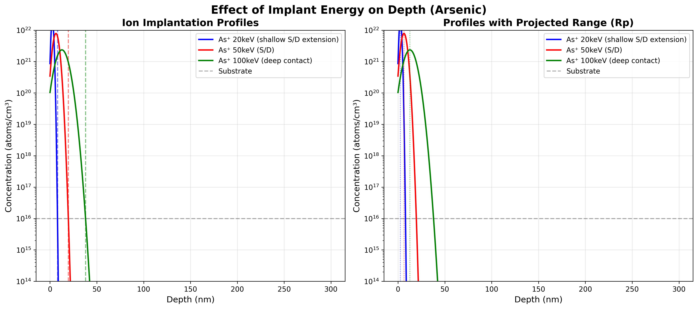
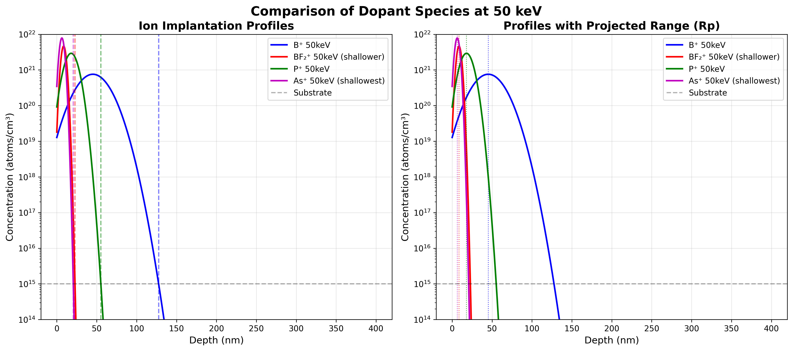
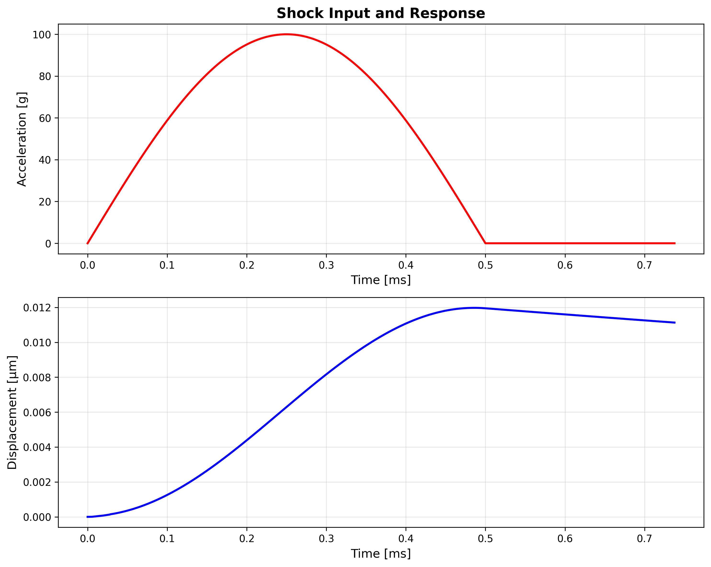
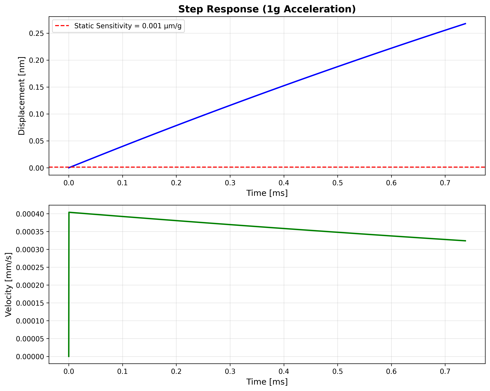
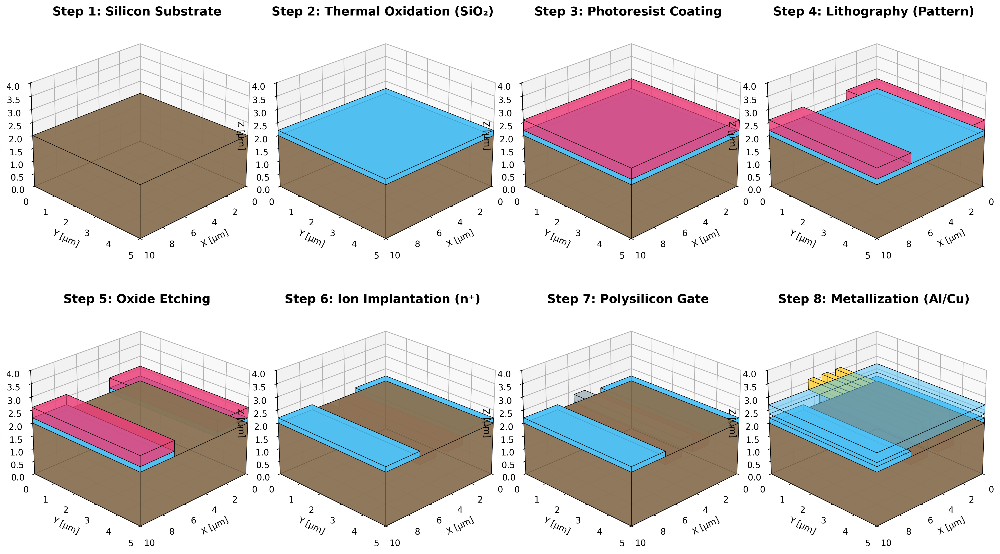

# Images

This folder contains generated figures used by the docs and simulations. Each image below includes a short description and the script that produces it.

## Cantilever Dynamics

Source: `docs/04-mems-surface-micromachining/mems_surface_micromachining_sim.py`

## Damascene Process Complete

Source: `docs/03-cmos-beol/damascene_process_simulator.py`

## Frequency Response

Source: `simulation-examples/python/mems_spring_mass.py`

## Interconnect Scaling

Source: `docs/03-cmos-beol/interconnect-scaling.py`

## Ion Implant Anneal Effects

Source: `docs/02-cmos-feol/ion-implantation.py`

## Ion Implant Energy Comparison

Source: `docs/02-cmos-feol/ion-implantation.py`

## Ion Implant Species Comparison

Source: `docs/02-cmos-feol/ion-implantation.py`

## Membrane Sensor Response

Source: `visualization/CAD/membrane_sensor.py`

## MEMS Design Space

Source: `docs/04-mems-surface-micromachining/mems_surface_micromachining_sim.py`

## NMOS Implant Stack

Source: `docs/02-cmos-feol/ion-implantation.py`

## PMOS Implant Stack

Source: `docs/02-cmos-feol/ion-implantation.py`

## Process Flow Stack

Source: `docs/04-mems-surface-micromachining/mems_surface_micromachining_sim.py`

## Release Optimization

Source: `docs/04-mems-surface-micromachining/mems_surface_micromachining_sim.py`

## Shock Response

Source: `simulation-examples/python/mems_spring_mass.py`

## Step Response

Source: `simulation-examples/python/mems_spring_mass.py`

## Stiction Analysis

Source: `docs/04-mems-surface-micromachining/mems_surface_micromachining_sim.py`

## 3D Chip Fabrication Process

Source: `simulation-examples/python/chip_fabrication_3d.py`

## Final MOSFET Structure

Source: `simulation-examples/python/chip_fabrication_3d.py`
