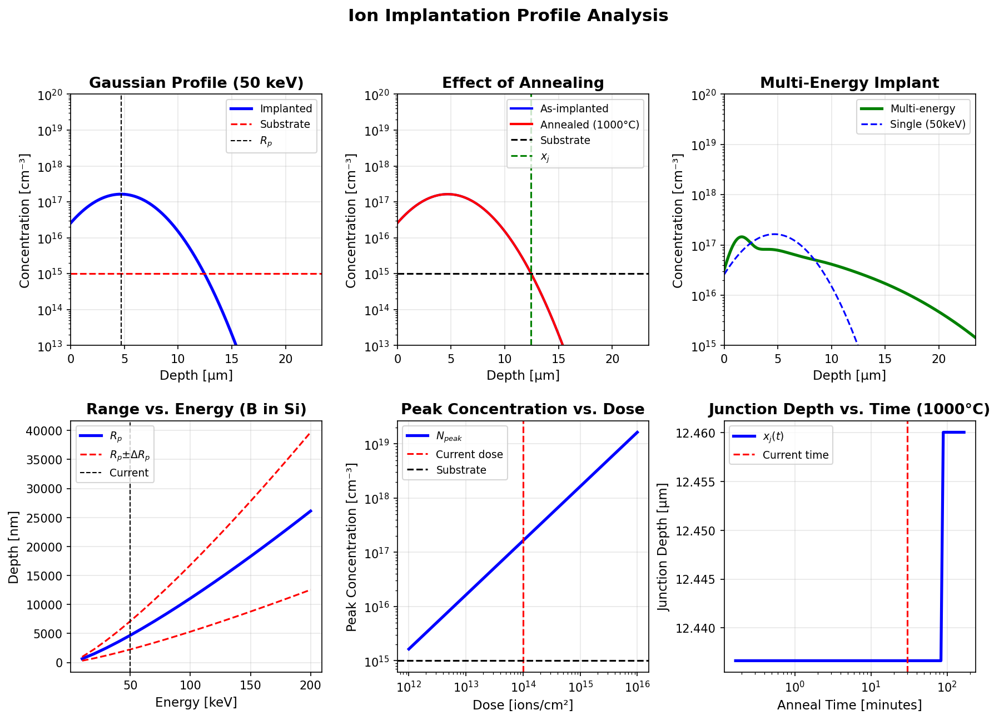
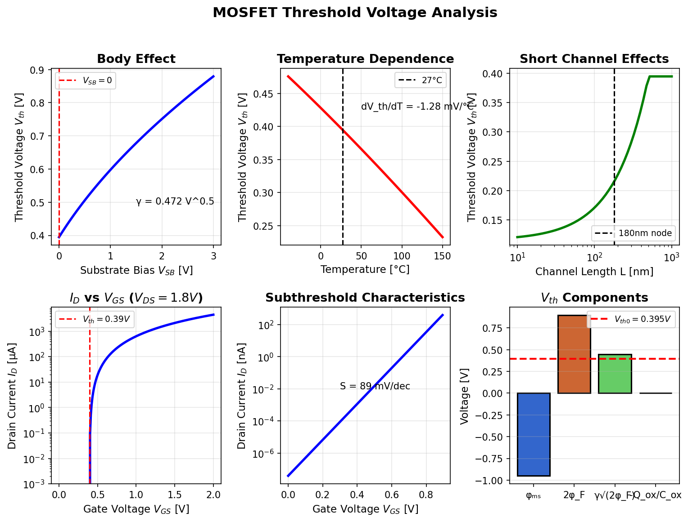
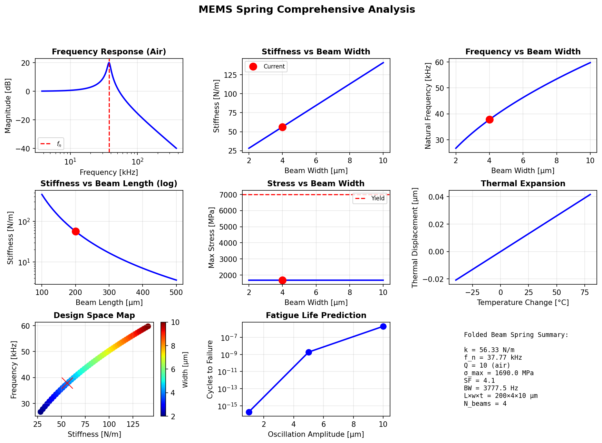
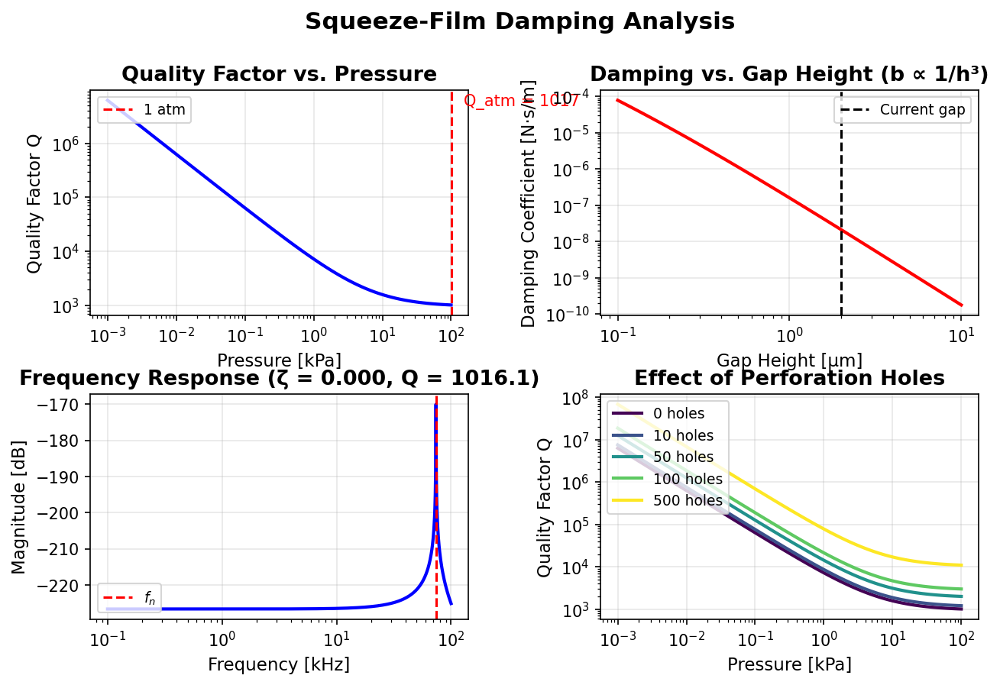
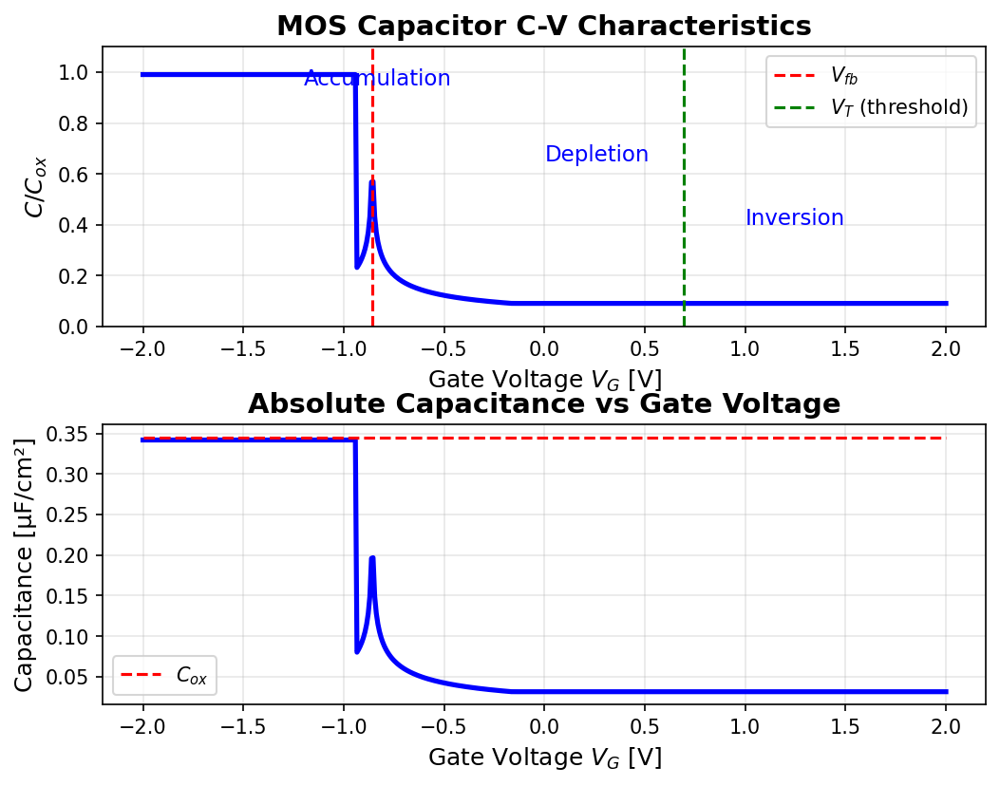

# MATLAB Simulation Examples

This folder contains MATLAB scripts that model core silicon fabrication and MEMS concepts. Each script prints a short console report and generates comprehensive figures that summarize the analysis.

## Requirements
- MATLAB R2020a+ (tested) or GNU Octave (most scripts should work; plotting style may vary)
- No external toolboxes required

## How to Run
From MATLAB, set your current folder to `simulation-examples/matlab`, then run a script:

```matlab
run('ion_implant_profile.m')
```

You can also open a script and press **Run** in the editor.

When you run a script locally, any saved figures are written to a local `images/` folder in the current working directory. The screenshots shown below live in the repository root at `images/` so they render on GitHub.

---

## Scripts and Outputs

### 1. `ion_implant_profile.m` — Ion Implantation Profile Analysis

Simulates dopant concentration profiles (Gaussian and multi-energy), annealing diffusion effects, and junction depth for implanted dopants in silicon. This is essential for understanding doping profiles in CMOS fabrication.

**Key Features:**
- LSS theory for range and straggle calculations
- Gaussian and dual-Pearson IV distribution models
- Multi-energy implants for box-like profiles
- Annealing effects with temperature-dependent diffusion
- Junction depth calculation
- Sheet resistance estimation

**Console Output Highlights:**
- Projected range (Rₚ) and straggle (ΔRₚ) from LSS theory
- Peak concentration and junction depth (xⱼ)
- Diffusion length after annealing (√2Dt)
- Sheet resistance estimate
- Comprehensive summary report and design guidelines

**Output Plot:**



**Plot Details:**
1. **Gaussian Profile** - Single-energy implant showing projected range (Rₚ) vs substrate doping
2. **As-Implanted vs Annealed** - Demonstrates profile broadening from thermal diffusion with junction depth marker
3. **Multi-Energy Implant** - Shows how multiple energies create uniform box-like profiles
4. **Range vs Energy** - Empirical relationship for Boron in Silicon (Rₚ ∝ E^1.24)
5. **Dose vs Peak Concentration** - Linear relationship in log-log space
6. **Junction Depth vs Anneal Time** - Shows junction deepening with longer thermal budget

**Typical Applications:**
- Source/drain formation in MOSFETs
- Well implants (p-well, n-well)
- Threshold voltage adjustment
- Channel stop implants

---

### 2. `mosfet_threshold.m` — MOSFET Threshold Voltage Analysis

Calculates and visualizes MOSFET threshold voltage (Vₜₕ) with comprehensive effects including body effect, temperature dependence, short-channel effects, and I-V characteristics. Critical for CMOS circuit design and device optimization.

**Key Features:**
- Complete Vₜₕ calculation with all components (φₘₛ, φF, γ, Qₒₓ)
- Body effect (substrate bias sensitivity)
- Temperature dependence (-40°C to 150°C)
- Short-channel effects and DIBL
- I-V and subthreshold characteristics
- Subthreshold swing calculation

**Console Output Highlights:**
- Threshold voltage components breakdown
- Body effect coefficient (γ) in V^0.5
- Temperature coefficient (dVₜₕ/dT) in mV/°C
- Short-channel rolloff and DIBL impact
- Subthreshold swing (mV/decade)
- Ion/Ioff ratio estimation

**Output Plot:**



**Plot Details:**
1. **Body Effect** - Vₜₕ increase with substrate bias (√2φF + VSB dependence)
2. **Temperature Dependence** - Typically -2 to -4 mV/°C for standard processes
3. **Short Channel Effects** - Vₜₕ rolloff below 180nm with DIBL contribution
4. **I-V Characteristics** - Saturation region current showing Vₜₕ extraction point
5. **Subthreshold Slope** - Log(ID) vs VGS with subthreshold swing indicator
6. **Vₜₕ Components** - Bar chart breaking down φₘₛ, 2φF, γ√2φF, and Qₒₓ/Cₒₓ contributions

**Design Implications:**
- Low-Vₜₕ (LVT): 0.2-0.3V for high performance
- Regular-Vₜₕ (RVT): 0.4-0.5V for balanced operation
- High-Vₜₕ (HVT): 0.6-0.8V for low leakage applications

---

### 3. `spring_design.m` — MEMS Spring Design & Analysis

Comprehensive design tool for folded-beam (default), serpentine, or crab-leg MEMS springs. Includes mechanical, dynamic, thermal, and reliability analysis - perfect for MEMS accelerometers, gyroscopes, and resonators.

**Key Features:**
- Three spring geometries (folded beam, serpentine, crab-leg)
- Full mechanical analysis (stiffness, compliance, stress)
- Dynamic response (natural frequency, Q-factor, bandwidth)
- Parametric design sweeps (width, length effects)
- Thermal expansion and stress
- Fatigue life prediction
- Shock survivability analysis

**Console Output Highlights:**
- Spring constant (k) and compliance
- Displacement under load with safety factor
- Natural frequency and bandwidth
- Width/length sweep design space
- Fatigue life estimates
- Shock survivability (typically 1000g)

**Output Plot:**



**Plot Details:**
1. **Frequency Response** - Resonance peak showing Q-factor in air (typically Q=10)
2. **Stiffness vs Beam Width** - Linear relationship (k ∝ w)
3. **Frequency vs Beam Width** - Square root dependence (f ∝ √k ∝ √w)
4. **Stiffness vs Beam Length** - Strong cubic dependence (k ∝ 1/L³)
5. **Stress vs Beam Width** - Decreasing stress with wider beams
6. **Thermal Expansion** - Linear displacement with temperature (α = 2.6 ppm/K for Si)
7. **Design Space Map** - k-f space colored by beam width
8. **Fatigue Life** - Cycles to failure vs oscillation amplitude
9. **Summary Panel** - Key design parameters at a glance

**Note:** This script does **not** save images by default. Use MATLAB's save button or add `saveas(gcf, 'images/spring_design.png')`.

**Typical Values:**
- Accelerometer: k = 1-100 N/m, f = 1-10 kHz
- Gyroscope: k = 10-1000 N/m, f = 5-20 kHz
- Resonator: k = 100-10000 N/m, f = 10-100 kHz

---

### 4. `squeeze_film_damping.m` — Squeeze-Film Damping in MEMS

Analyzes viscous air damping for micro-plates oscillating parallel to a substrate. Includes rarefaction effects (Knudsen number), pressure dependence, and perforation hole analysis. Essential for Q-factor prediction and package design.

**Key Features:**
- Squeeze-film damping coefficient calculation
- Rarefaction correction for small gaps (Kn effects)
- Quality factor vs pressure (1 Pa to 100 kPa)
- Gap height dependence (b ∝ 1/h³)
- Frequency response with damping
- Perforation hole analysis for venting

**Console Output Highlights:**
- Damping coefficient (squeeze + border effects)
- Rarefaction correction factor (Qeff)
- Natural frequency and damping ratio (ζ)
- Knudsen number regime classification
- Q-factor at atmospheric pressure
- Design recommendations for high/low Q

**Output Plot:**



**Plot Details:**
1. **Quality Factor vs Pressure** - Dramatic Q increase in vacuum (Q ∝ 1/P)
2. **Damping vs Gap Height** - Strong cubic dependence (b ∝ 1/h³)
3. **Frequency Response** - Resonance peak with air damping (ζ ≈ 0.05 at 1 atm)
4. **Effect of Perforation Holes** - Q enhancement through venting for different hole counts

**Regime Classification:**
- Continuum (Kn < 0.01): Navier-Stokes valid
- Slip flow (0.01 < Kn < 0.1): Velocity slip at boundaries
- Transition (Kn > 0.1): Rarefied gas effects significant

**Typical MEMS Q Values:**
- Consumer accelerometer: Q = 10-100 (air damped)
- Gyroscope: Q = 1,000-10,000 (vacuum packaged)
- Resonator: Q = 10,000-100,000 (high vacuum)

---

### 5. `thermal_analysis.m` — MEMS Thermal Analysis & Optimization

Comprehensive thermal modeling for MEMS devices (cantilever/bridge/membrane geometries). Covers steady-state heat transfer, transient response, thermal stress, temperature coefficients, package heating, and thermal cycling effects.

**Key Features:**
- Thermal resistance network (conduction + convection)
- Thermal capacitance and time constant
- Steady-state temperature rise vs power
- Transient thermal response
- Thermal stress calculation (σₜₕ = EαΔT)
- Material property comparison (Si, SiO₂, SiN, Al)
- Package-level heating analysis
- Thermal cycling simulation
- Application examples (actuator, bolometer, resonator)

**Console Output Highlights:**
- Thermal resistances (Rcond, Rconv, Rtotal)
- Thermal time constant (τ = RC)
- Temperature rise per unit power (K/W)
- Thermal stress at ΔT = 100K
- Frequency shift from thermal coefficient
- Package self-heating effects
- Thermal cycling stress analysis

**Output Plot:**


**Plot Details:**
1. **Steady-State Temp vs Power** - Linear relationship with thermal resistance
2. **Transient Response** - Exponential approach to steady-state (τ = RC)
3. **Thermal Stress vs ΔT** - Linear stress buildup (σ = EαΔT/(1-ν))
4. **Thermal Deflection** - Bimetallic effect in composite structures
5. **Material Thermal Conductivity** - Si highest (148 W/m·K), SiO₂ lowest (1.4 W/m·K)
6. **Material CTE Comparison** - Al highest (23 ppm/K), SiO₂ lowest (0.5 ppm/K)
7. **Package Heating** - Junction temperature vs package power
8. **Thermal Cycling** - Sinusoidal temperature profile
9. **Heat Flux Distribution** - Uniform dissipation across device
10. **Temperature Distribution** - Linear gradient along beam
11. **Frequency Shift** - TCF effects on resonators (-30 ppm/K typical)
12. **Summary Panel** - Key thermal parameters

**Note:** This script does **not** save images by default. Use MATLAB's save button or add `saveas(gcf, 'images/thermal_analysis.png')`.

**Critical Design Considerations:**
- Thermal stress: σₜₕ < σyield/2 (safety factor ≥ 2)
- Time constant: τ < 1ms for fast thermal actuators, τ > 10ms for stable sensors
- Package power: Total dissipation < 5W for standard packages
- Operating range: -40°C to 125°C for automotive grade

---

### 6. `capacitor_model.m` — MOS Capacitor C-V Simulation

Simulates MOS capacitor C-V characteristics across accumulation, depletion, and inversion regions. Fundamental for understanding MOSFET gate capacitance, DRAM cells, and varactors.

**Key Features:**
- Three-region C-V curve (accumulation/depletion/inversion)
- Flat-band voltage (Vfb) calculation
- Threshold voltage extraction
- Debye length and maximum depletion width
- High-frequency C-V response

**Console Output Highlights:**
- Oxide capacitance (Cox) in μF/cm²
- Fermi potential (φF) from doping
- Flat-band voltage (Vfb = φₘ - φsi)
- Threshold voltage (Vt ≈ 2φF for ideal MOS)
- Debye length (λD)
- Maximum depletion width (Wmax)

**Output Plot:**



**Plot Details:**
1. **Normalized C/Cox vs VG** - Three distinct regions with Vfb and Vt markers
   - Accumulation: C ≈ Cox (holes accumulate)
   - Depletion: C < Cox (depletion region grows)
   - Inversion: C ≈ constant (electron inversion layer forms)
2. **Absolute Capacitance vs VG** - Shows Cox maximum and series capacitance effect

**Physics Summary:**
- **Accumulation** (VG < Vfb): Majority carriers (holes for p-type) pile up at surface
- **Depletion** (Vfb < VG < Vt): Depletion region extends into substrate
- **Inversion** (VG > Vt): Minority carriers (electrons) form inversion layer

**Note:** This script does **not** save images by default. Use MATLAB's save button or add `saveas(gcf, 'images/capacitor_model.png')`.

**Applications:**
- MOSFET gate capacitance modeling
- DRAM storage capacitors
- Voltage-controlled capacitors (varactors)
- Doping profile extraction (C-V profiling)

---

## Output Folder

Scripts that automatically save images will create `simulation-examples/matlab/images/` if it does not exist:
- `ion_implant_profile.png` (automatically saved)
- `mosfet_threshold.png` (automatically saved)
- `squeeze_film_damping.png` (automatically saved)
- `spring_design.png` (manual save required)
- `thermal_analysis.png` (manual save required)
- `capacitor_model.png` (manual save required)

## Tips

- **Parameters are declared near the top** of each script for easy modification
- For **Octave users**, minor plot styling differences are expected but functionality is preserved
- To **export figures** from scripts that don't auto-save, add:

```matlab
saveas(gcf, 'images/my_figure.png')
```

- Use `help script_name` or open the script to see detailed parameter descriptions
- Modify material properties, dimensions, or operating conditions to explore different designs
- Scripts include comprehensive **design guidelines** in console output

## Learning Path

Recommended order for understanding silicon fabrication:

1. **capacitor_model.m** - Start with basic MOS physics
2. **mosfet_threshold.m** - Understand transistor behavior
3. **ion_implant_profile.m** - Learn doping techniques
4. **spring_design.m** - Introduction to MEMS mechanics
5. **squeeze_film_damping.m** - MEMS-specific damping phenomena
6. **thermal_analysis.m** - Comprehensive thermal management

## Contributing

To add new simulation examples:
1. Follow the existing script structure with clear sections
2. Include comprehensive comments and design guidelines
3. Generate publication-quality figures with proper labels
4. Add console output summary with key results
5. Update this README with your new script

## References

- S.M. Sze, "Physics of Semiconductor Devices" (3rd Edition)
- S.D. Senturia, "Microsystem Design" (Kluwer Academic)
- M. Madou, "Fundamentals of Microfabrication" (CRC Press)
- SRIM/TRIM database for ion implantation ranges
- Process integration textbooks for typical fabrication parameters

---

**Last Updated:** January 2026  
**License:** MIT  
**Author:** Silicon Fabrication Handbook Contributors
