# Python Simulation Examples

**Interactive semiconductor device physics and MEMS simulations for learning and research.**

This directory contains Python-based computational models that bring silicon fabrication to life through:
- **Device physics modeling** (MOSFETs, thermal oxidation)
- **MEMS system dynamics** (resonators, comb drives, accelerometers)
- **3D visualizations** (device structures, process evolution)

All outputs are automatically saved to organized image folders for easy access and integration into reports.

---

## Quick Start

### 1. Setup Environment

```bash
# Install dependencies
pip install -r requirements.txt
```

### 2. Run a Simulation

```bash
# Example: Thermal oxidation analysis
python oxide_growth_model_3D.py

# Example: MOSFET I-V curves
python mosfet_iv_curves_3D.py

# Example: MEMS resonator
python resonator_response_3D.py
```

### 3. Find Your Results

All plots are automatically saved to:
```
simulation-examples/python/images/
├── oxide/          # Thermal oxidation results
├── mosfet/         # MOSFET analysis plots
└── resonator/      # MEMS resonator data
```

---

## 📁 Simulation Modules

### Featured Simulations (Auto-Save Images)

| Module | What It Does | Output Location |
|--------|--------------|-----------------|
| **`oxide_growth_model_3D.py`** | Models thermal oxidation using Deal-Grove kinetics. Analyzes wet vs. dry oxidation, temperature effects, and crystal orientation dependence. | `images/oxide/` |
| **`mosfet_iv_curves_3D.py`** | Simulates MOSFET electrical characteristics across all operating regions (linear, saturation, subthreshold). Includes parameter extraction and 3D device rendering. | `images/mosfet/` |
| **`resonator_response_3D.py`** | Analyzes MEMS resonator frequency response with multiple damping models. Includes nonlinear effects and fabrication sensitivity. | `images/resonator/` |

### Additional Simulations

| Module | Description | Output |
|--------|-------------|--------|
| `comb_drive_analysis_3D.py` | Electrostatic comb-drive actuator with force, capacitance, and displacement analysis | Runtime display |
| `mems_spring_mass.py` | Spring-mass-damper accelerometer with time/frequency response | `images/` (local) |
| `mems_spring_mass.ipynb` | Interactive Jupyter notebook version | In-notebook |
| `capacitive_sensor_3d.py` | 3D capacitive accelerometer visualization | `images/` (local) |
| `chip_fabrication_3d.py` | Layer-by-layer CMOS fabrication process | `images/` (local) |
| `thermal_actuaror_sim3d2.py` | Animated thermal actuator with UI controls | Runtime animation |

---

##  Understanding the Plots

###  Thermal Oxidation (`oxide_growth_model_3D.py`)

#### 1. Thickness vs. Time (Linear Scale)
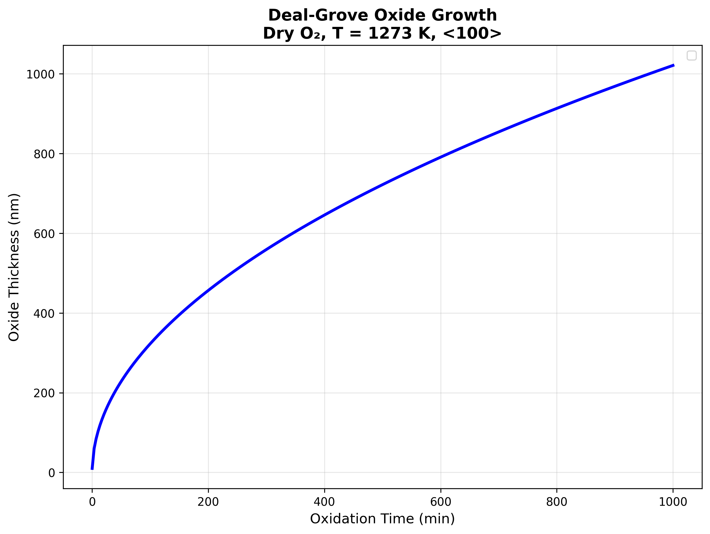

**What it shows:** How silicon dioxide (SiO₂) thickness grows over time during thermal oxidation.

**Key features:**
- **Initial fast growth** (linear regime): Reaction-limited, controlled by oxidant arrival at Si surface
- **Later slowdown** (parabolic regime): Diffusion-limited, oxidant must diffuse through existing oxide
- **Transition point** marked with vertical line (~50-100 min for dry oxidation at 1000°C)

**Why it matters:** Determines oxidation time recipes for gate oxides, field oxides, and passivation layers.

---

#### 2. Thickness vs. Time (Log-Log Scale)
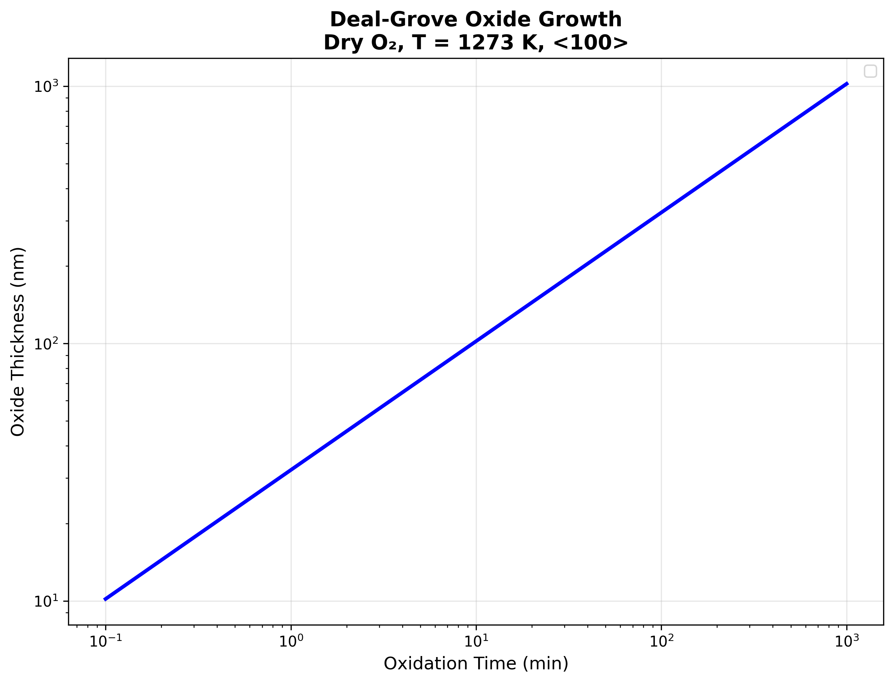

**What it shows:** Same data on logarithmic axes to clearly reveal the two growth regimes.

**Key features:**
- **Linear regime**: Straight line with slope = 1 (x ∝ t)
- **Parabolic regime**: Straight line with slope = 0.5 (x ∝ √t)
- **Clean transition** between regimes visible as slope change

**Why it matters:** Confirms Deal-Grove model validity and helps identify dominant growth mechanism.

---

#### 3. Growth Rate vs. Time
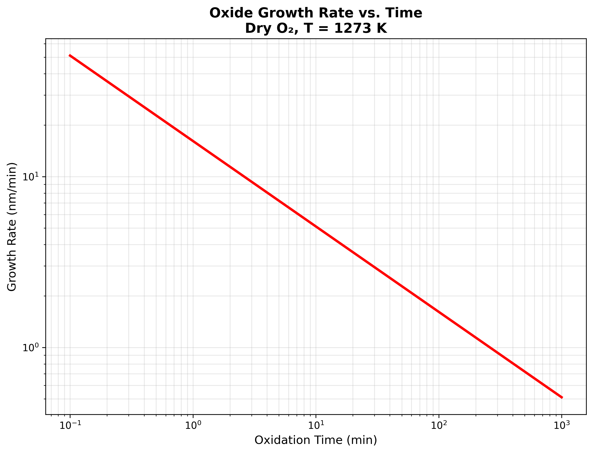

**What it shows:** Instantaneous growth rate (dx/dt) decreases over time.

**Key features:**
- **High initial rate** (~10 nm/min for dry O₂ at 1000°C)
- **Gradual decrease** as oxide thickens (diffusion barrier effect)
- **Asymptotic behavior** toward very slow growth

**Why it matters:** Explains why thick oxides (>500 nm) require impractically long times, motivating wet oxidation or LPCVD alternatives.

---

#### 4. Temperature Dependence
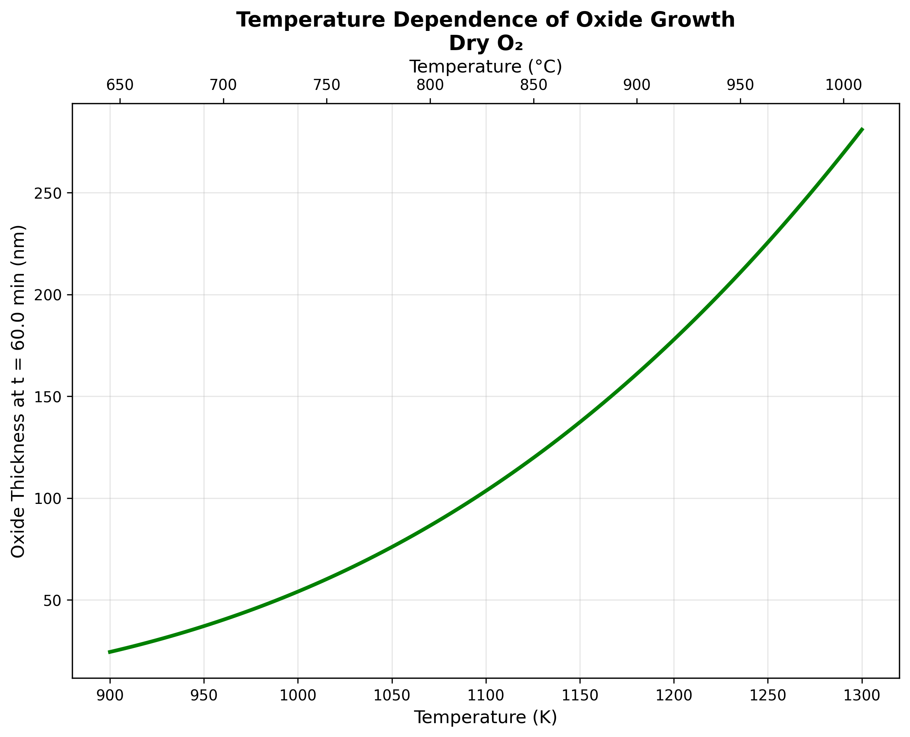

**What it shows:** Oxide thickness achieved in fixed time (e.g., 60 min) vs. furnace temperature.

**Key features:**
- **Exponential increase** (Arrhenius behavior)
- **Typical range**: 900-1200°C for thermal oxidation
- **Activation energy**: Encoded in curve steepness

**Why it matters:** Higher temperatures enable faster oxidation but risk dopant redistribution and stress. Trade-off between throughput and device quality.

---

#### 5. Wet vs. Dry Oxidation
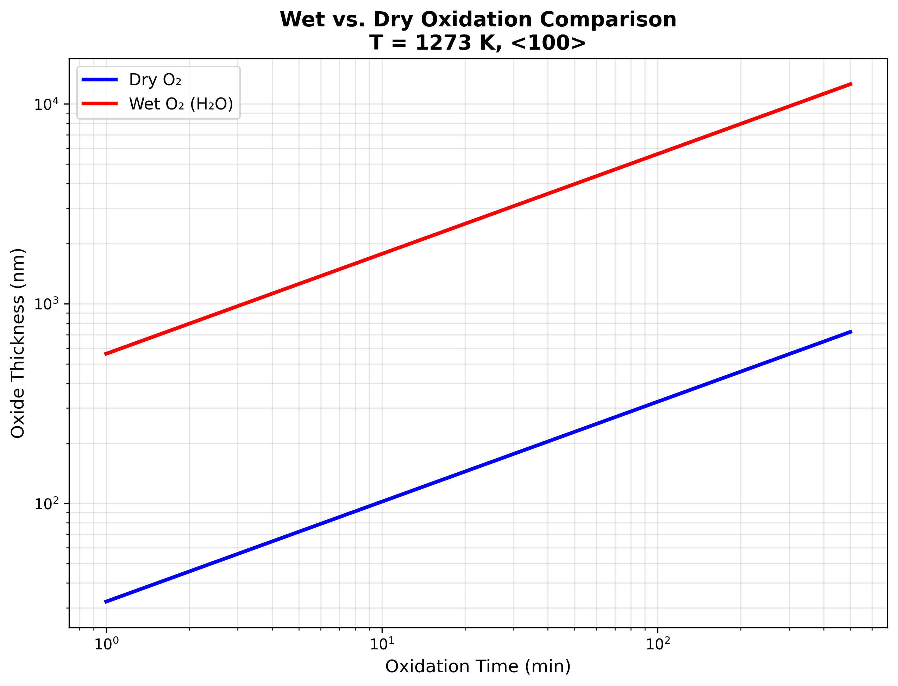

**What it shows:** Direct comparison of H₂O (wet) and O₂ (dry) oxidation rates.

**Key features:**
- **~10× faster growth** with wet oxidation (steam)
- **Both follow Deal-Grove** kinetics but different coefficients
- **Crossover behavior** at very thin oxides

**Why it matters:**
- **Dry O₂**: High-quality gate oxides (<50 nm), better electrical properties
- **Wet O₂/Steam**: Thick field oxides (>300 nm), faster but slightly lower quality

---

#### 6. Crystal Orientation Effects
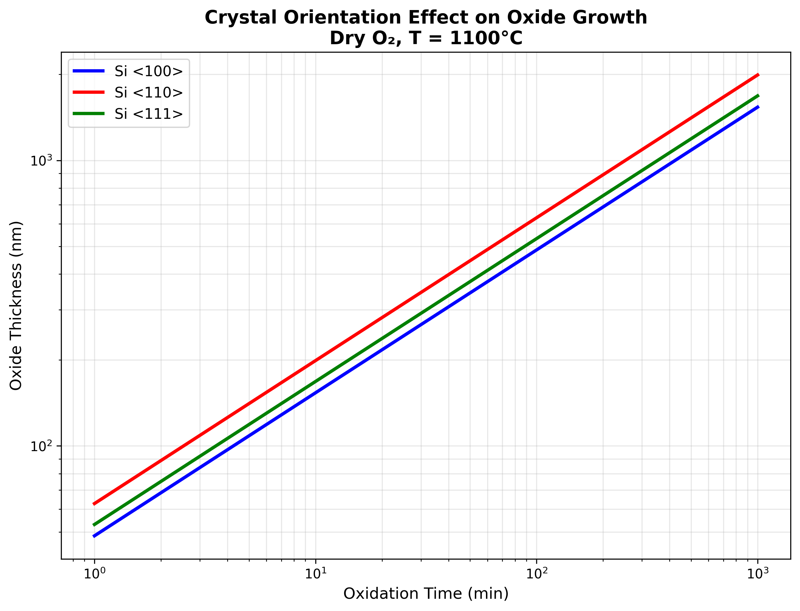

**What it shows:** Growth rate varies with silicon crystal orientation.

**Key features:**
- **<110> fastest** (1.7× faster than <100>)
- **<111> intermediate** (1.2× faster than <100>)
- **<100> slowest** (baseline)

**Why it matters:** Wafer orientation affects oxide thickness uniformity across features. STI (shallow trench isolation) corners require orientation-aware modeling.

---

#### 7. 3D Cross-Section
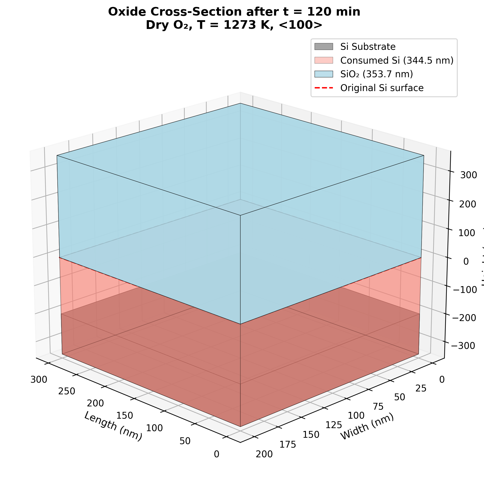

**What it shows:** Spatial view of oxide layer growth and silicon consumption.

**Key features:**
- **Light blue**: Grown oxide layer (SiO₂)
- **Salmon/pink**: Consumed silicon region (~44% of oxide thickness)
- **Red dashed plane**: Original silicon surface before oxidation
- **Gray**: Bulk silicon substrate

**Why it matters:** Shows that oxidation **consumes** silicon (Si + O₂ → SiO₂), causing topography changes and stress. Critical for LOCOS bird's beak effects.

---

#### 8. 3D Growth Evolution
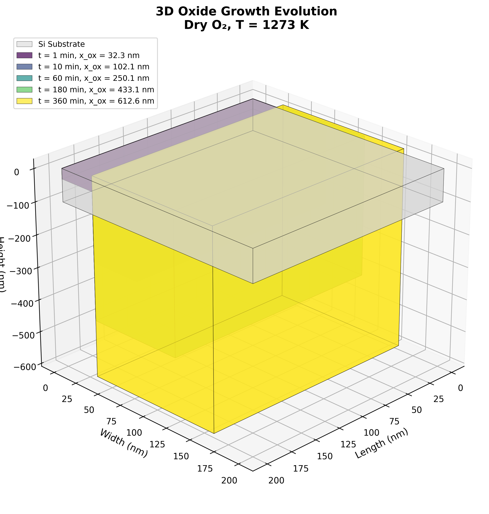

**What it shows:** Time-lapse of oxide growth as side-by-side layers.

**Key features:**
- **Color coding**: Viridis colormap (purple → yellow) indicates time progression
- **Increasing thickness**: Later time points show thicker oxide
- **Spatial arrangement**: Multiple time snapshots in one view

**Why it matters:** Visualizes kinetics evolution and helps estimate intermediate process steps.

---

### ⚡ MOSFET I-V Characteristics (`mosfet_iv_curves_3D.py`)

#### 1. Transfer Characteristics (Linear Scale)
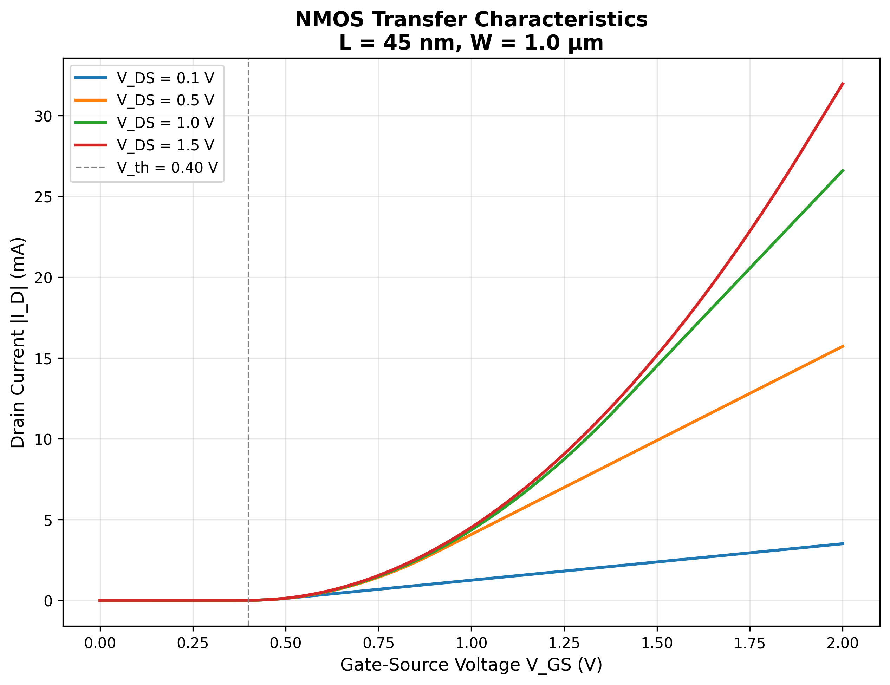

**What it shows:** Drain current (I_D) vs. gate voltage (V_GS) at fixed V_DS.

**Key features:**
- **Off region**: I_D ≈ 0 when V_GS < V_th
- **Linear increase**: I_D rises as V_GS increases above threshold
- **Multiple V_DS curves**: Higher V_DS → higher current
- **Threshold voltage** marked with vertical dashed line

**Why it matters:** 
- Determines **on/off current ratio** (I_on/I_off) — critical for digital circuits
- Shows **threshold voltage V_th** — key process parameter
- Reveals **overdrive voltage** dependence

---

#### 2. Transfer Characteristics (Log Scale)
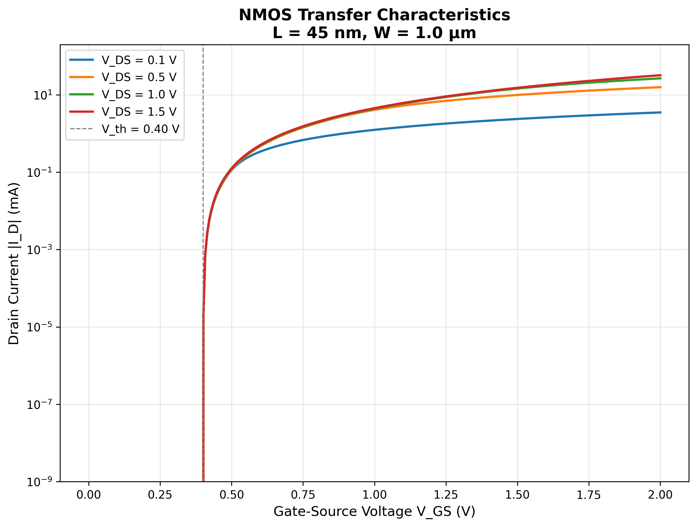

**What it shows:** Same data with logarithmic y-axis to reveal **subthreshold region**.

**Key features:**
- **Subthreshold slope**: ~80 mV/decade (exponential I_D behavior below V_th)
- **Off-state leakage**: Minimum current when device is "off" (~pA to nA)
- **Linear region**: Still visible at top of plot
- **7-8 orders of magnitude** current range visible

**Why it matters:**
- **Subthreshold slope** determines switching speed and power efficiency
- **Leakage current** causes static power dissipation in CMOS
- Critical for **low-power design** and **threshold tuning**

---

#### 3. Output Characteristics
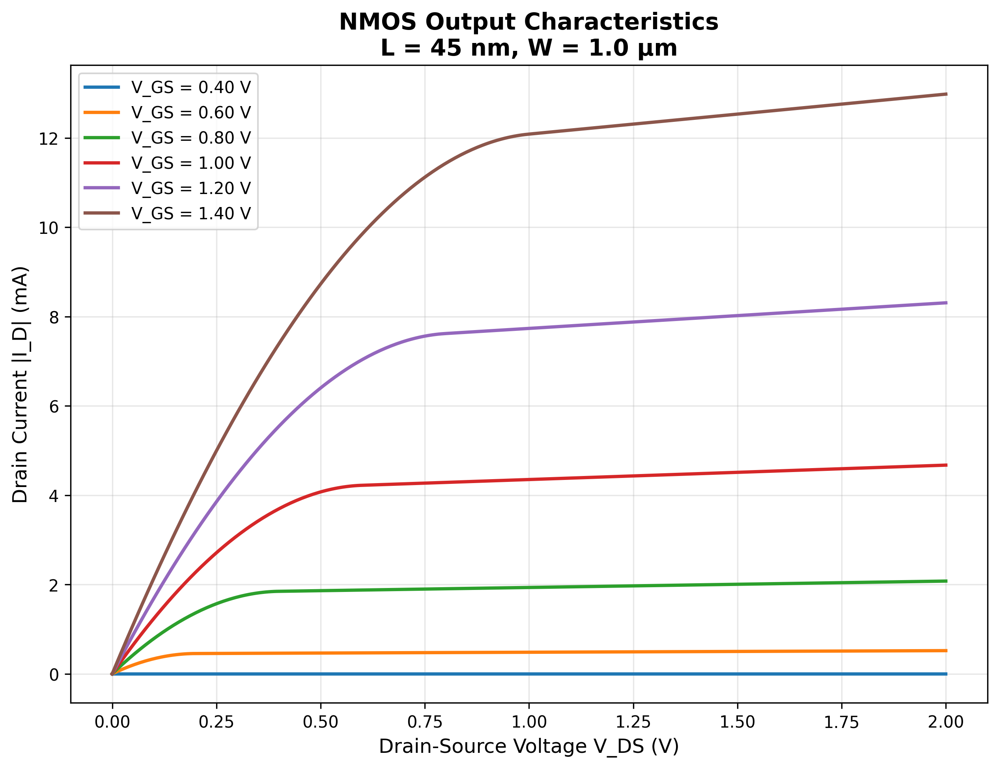

**What it shows:** Drain current (I_D) vs. drain voltage (V_DS) for various V_GS.

**Key features:**
- **Linear/triode region**: I_D increases linearly with V_DS (left side)
- **Saturation region**: I_D plateaus (flat curves on right)
- **Pinch-off point**: Where curves transition (~V_DS = V_GS - V_th)
- **Channel-length modulation**: Slight upward slope in saturation (Early effect)

**Why it matters:**
- Defines **operating regions** for analog amplifiers (saturation) vs. switches (triode)
- Shows **output resistance** (r_o = 1/slope in saturation)
- Critical for **transistor sizing** and **bias point selection**

---

#### 4. Small-Signal Parameters
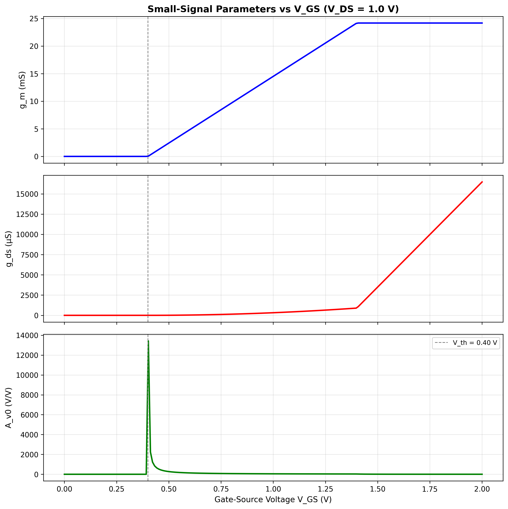

**What it shows:** Three key AC parameters vs. V_GS at fixed V_DS.

**Key features:**
- **Top panel (g_m)**: Transconductance peaks near moderate V_GS
- **Middle panel (g_ds)**: Output conductance increases with V_GS
- **Bottom panel (A_v0)**: Intrinsic gain = g_m/g_ds (V/V)

**Why it matters:**
- **g_m** determines voltage gain in amplifiers (higher is better)
- **g_ds** sets output resistance (lower is better for gain)
- **A_v0** is maximum achievable gain for single transistor stage (typically 20-100)

---

#### 5. Channel Length Comparison
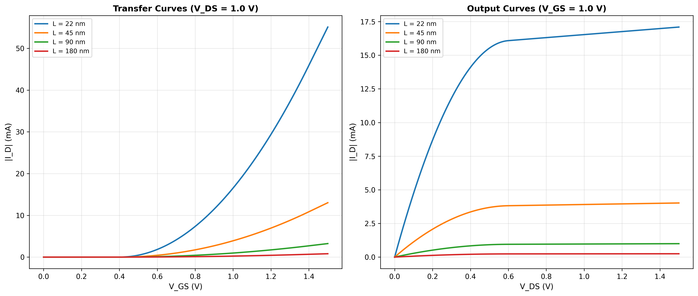

**What it shows:** How I-V curves change with technology scaling (180nm → 22nm).

**Key features:**
- **Shorter channels** → higher current density (same V_GS)
- **Increased DIBL** (drain-induced barrier lowering): V_th decreases with V_DS
- **Velocity saturation**: Output curves flatten earlier
- **Trade-off**: Speed vs. short-channel effects

**Why it matters:** Shows why **advanced nodes** (<45nm) require:
- High-k/metal gate (HKMG) to control leakage
- FinFET/GAA structures for better electrostatics
- Strain engineering for mobility boost

---

#### 6. 3D I-V Surface
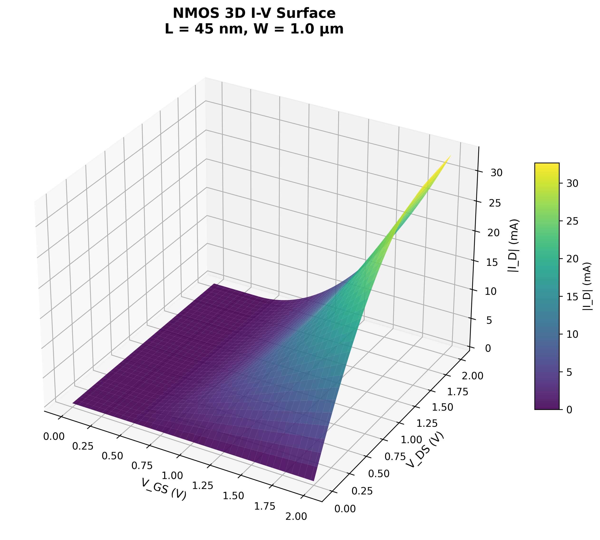

**What it shows:** Complete I_D(V_GS, V_DS) operating space as a colored surface.

**Key features:**
- **Color coding**: Viridis → current magnitude
- **Plateau region**: Saturation (flat top)
- **Steep rise**: Linear region (front slope)
- **Threshold boundary**: Visible as sharp edge

**Why it matters:** Provides intuitive 3D view of all operating regions simultaneously — useful for teaching and visualization.

---

#### 7. 3D Device Structure
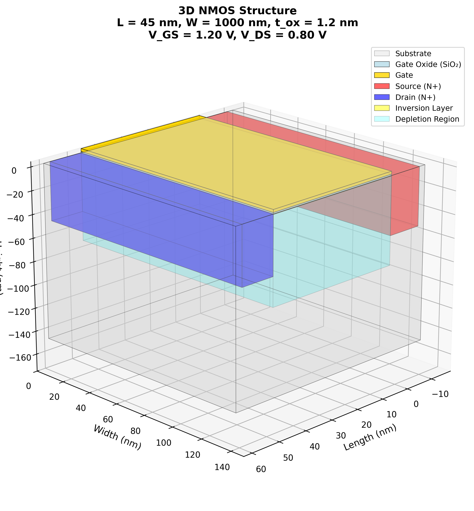

**What it shows:** Physical cross-section of MOSFET with labeled regions.

**Key features:**
- **Gold**: Polysilicon or metal gate electrode
- **Light blue**: Gate oxide (SiO₂, ~1-2 nm modern devices)
- **Red**: N+ source (for NMOS) — heavily doped n-type
- **Blue**: N+ drain (for NMOS)
- **Gray**: P-type substrate
- **Yellow/cyan**: Inversion/depletion layers when biased

**Why it matters:** Connects electrical behavior to physical structure. Shows where current flows (inversion channel) and how gate controls it.

---

### 🎵 MEMS Resonator (`resonator_response_3D.py`)

#### 1. Bode Plot (Magnitude & Phase)
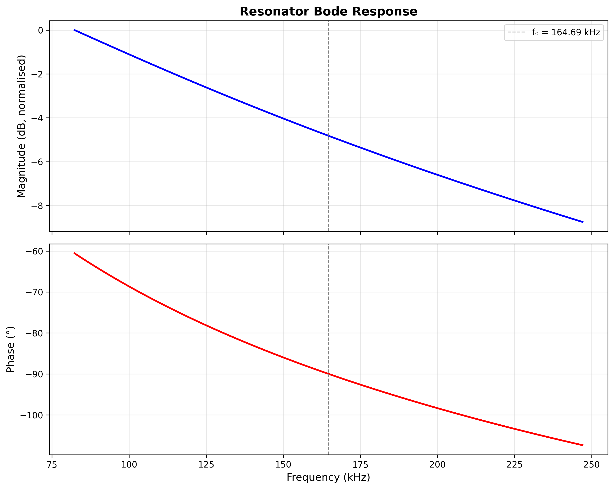

**What it shows:** Frequency response of resonator (displacement per unit force).

**Key features:**
- **Top panel**: Magnitude peaks at resonant frequency f₀ (~100 kHz typical)
- **Bottom panel**: Phase shifts from 0° → -90° → -180° through resonance
- **-3 dB bandwidth**: Determines quality factor Q
- **Sharpness**: High Q → narrow peak (low damping)

**Why it matters:**
- **Resonant frequency** sets operating point for filters, oscillators, gyroscopes
- **Q-factor** determines sensitivity and frequency selectivity
- **Bandwidth** limits response speed

---

#### 2. Nyquist Plot
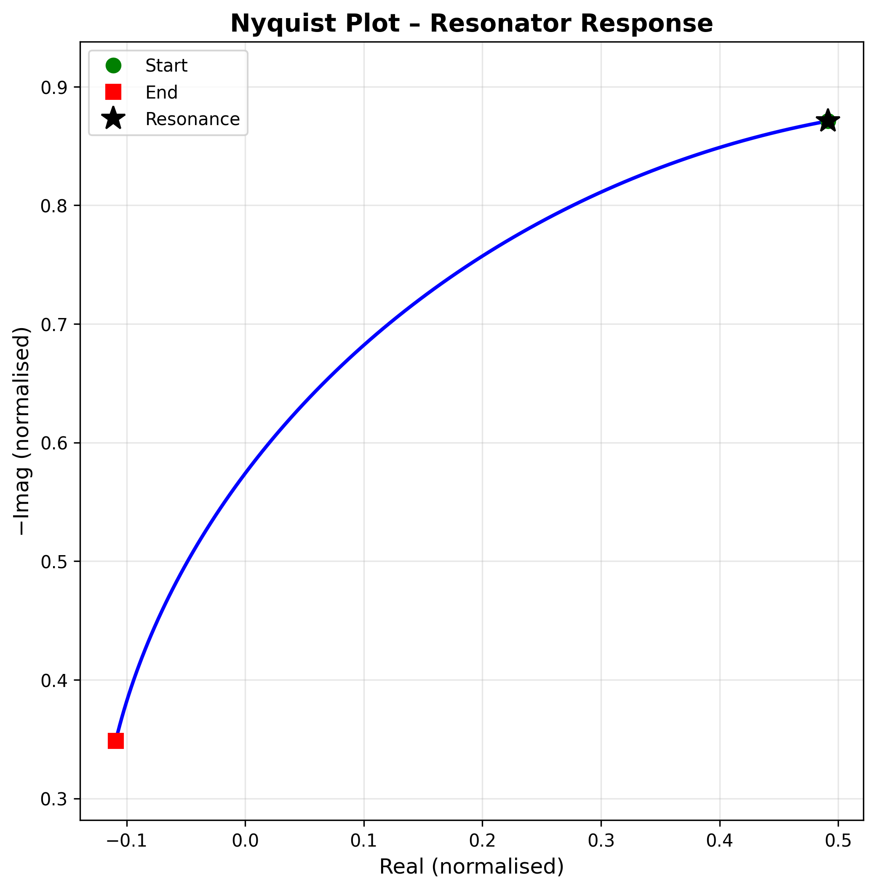

**What it shows:** Complex impedance (real vs. imaginary) as frequency varies.

**Key features:**
- **Circular arc**: Characteristic of 2nd-order resonator
- **Resonance point** (marked with star): Peak of imaginary component
- **Start/end markers**: Green (low freq) to red (high freq)
- **Diameter**: Related to Q-factor

**Why it matters:**
- **Alternative visualization** to Bode plot
- Used for **Q-factor extraction** via circle fitting
- Common in electrical impedance spectroscopy

---

#### 3. Damping Model Comparison
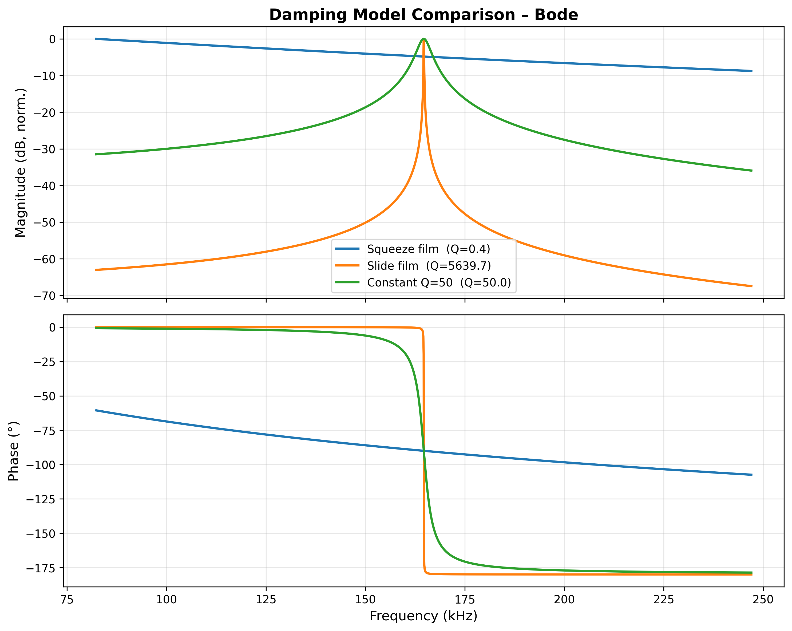

**What it shows:** Three different damping mechanisms produce different Q-factors.

**Key features:**
- **Squeeze-film** (blue): Low Q (~10-50), high damping from air between surfaces
- **Slide-film** (orange): Medium Q (~50-100), Couette flow damping
- **Constant Q** (green): User-defined Q for idealized analysis

**Why it matters:**
- **Vacuum packaging** needed for high Q (eliminate squeeze-film)
- **Gap size** strongly affects damping (smaller gap → higher damping)
- Determines **ringdown time** and **sensitivity** in sensors

---

#### 4. Duffing Backbone Curve
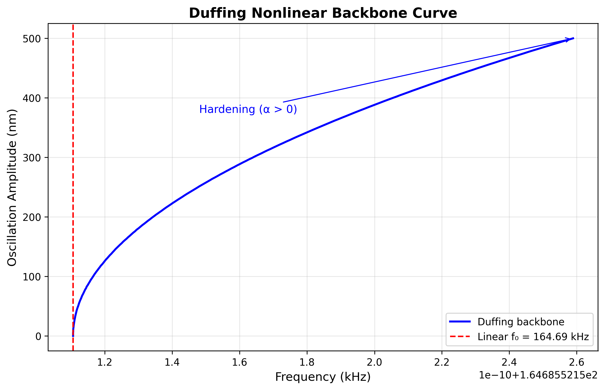

**What it shows:** Nonlinear frequency shift at large oscillation amplitudes.

**Key features:**
- **Blue curve**: Backbone showing peak response frequency vs. amplitude
- **Red dashed line**: Linear natural frequency f₀
- **Hardening**: Frequency increases with amplitude (α > 0)
- **Annotation**: Indicates hardening or softening behavior

**Why it matters:**
- **Amplitude-dependent tuning** in RF MEMS switches
- **Jump phenomenon** and **hysteresis** in driven resonators
- **Dynamic range** limitations in sensors

---

#### 5. Sensitivity Analysis
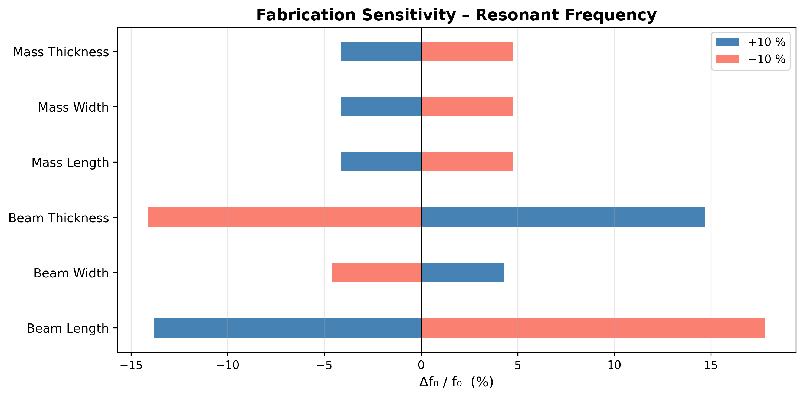

**What it shows:** How fabrication tolerances affect resonant frequency.

**Key features:**
- **Horizontal bars**: ±10% variation in each geometric parameter
- **Blue bars**: Positive variation (+10%)
- **Red bars**: Negative variation (-10%)
- **Beam thickness**: Typically most sensitive parameter

**Why it matters:**
- **Process control** requirements for consistent devices
- **Trimming strategy**: Which parameters to adjust post-fabrication
- **Yield analysis**: Predicts frequency distribution across wafer

---

#### 6. 3D Resonator Structure
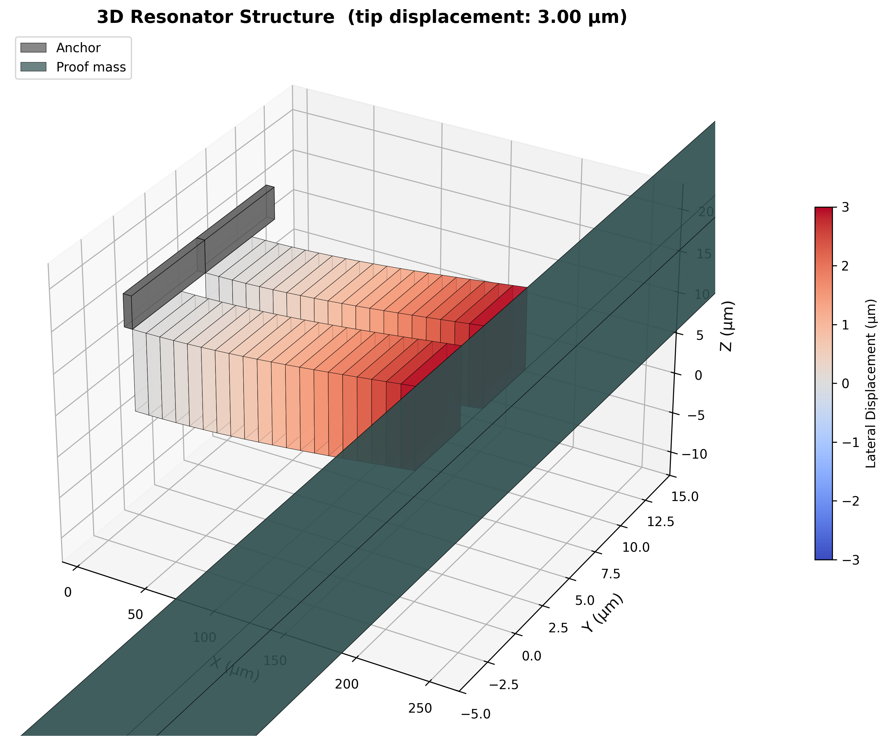

**What it shows:** Mechanical structure with deflected mode shape.

**Key features:**
- **Color mapping**: Cool→warm = low→high displacement
- **Fixed-guided beams**: Dark blue (anchors) support structure
- **Proof mass**: Dark gray block at free end
- **Mode shape**: Parabolic deflection (1st bending mode)

**Why it matters:** Visualizes how structure deforms during oscillation. Essential for understanding stress distribution and failure modes.

---

## 🛠️ Customizing Simulations

All modules are designed to be modified. Here are common customizations:

### Oxide Growth
```python
# Change temperature
params = OxidationParameters(
    temperature=1373,     # 1100°C instead of 1000°C
    ambient='wet',        # Use steam
    orientation='<111>'   # Different crystal plane
)
```

### MOSFET
```python
# Simulate different technology node
geometry = MOSFETGeometry(
    channel_length=22e-9,    # 22nm node
    oxide_thickness=0.9e-9,  # High-k equivalent
)
```

### Resonator
```python
# Adjust damping
damping = DampingModel(
    model_type='squeeze',
    gap=1e-6,               # 1 μm gap
    pressure=1e-3 * P_ATM   # Vacuum (1 mTorr)
)
```

---

##  Learning Resources

### For Beginners
1. Start with **oxide_growth_model_3D.py** — simplest physics
2. Move to **mosfet_iv_curves_3D.py** — builds on oxidation
3. Explore **resonator_response_3D.py** — introduces dynamics

### For Advanced Users
- Modify source code to explore parameter spaces
- Integrate with experimental data (CSV import)
- Export results for publication (`save_path` parameter)

### Textbook References
- **Oxide Growth**: Deal & Grove, "General Relationship for the Thermal Oxidation of Silicon" (1965)
- **MOSFET**: Tsividis & McAndrew, "Operation and Modeling of the MOS Transistor" (2011)
- **MEMS**: Senturia, "Microsystem Design" (2001)

---

## 🐛 Troubleshooting

### Common Issues

**Import errors:**
```bash
# Make sure all dependencies installed
pip install --upgrade -r requirements.txt
```

**Plots don't save:**
- Check that script has write permissions in current directory
- Verify `images/` subdirectories exist (auto-created on run)

**Matplotlib backend issues:**
```python
# Add to top of script if running headless
import matplotlib
matplotlib.use('Agg')
```

**Memory errors (large 3D plots):**
- Reduce mesh resolution in 3D surface plots
- Close previous figure windows

---

##  Contributing

Found a bug or have an enhancement?

1. **Issues**: Report problems via GitHub Issues
2. **Pull Requests**: Improvements welcome!
3. **Documentation**: Help us make this clearer

---

##  License

MIT License - Free for academic and commercial use.

Part of the **Silicon Fabrication Handbook** project:
🔗 https://github.com/Zeyad-Mustafa/silicon-fabrication-handbook

---

##  Quick Reference

| Want to... | Run this... |
|------------|-------------|
| Learn thermal oxidation basics | `python oxide_growth_model_3D.py` |
| Understand MOSFET operation | `python mosfet_iv_curves_3D.py` |
| Analyze MEMS resonators | `python resonator_response_3D.py` |
| Study comb-drive actuators | `python comb_drive_analysis_3D.py` |
| Simulate accelerometers | `python mems_spring_mass.py` |

**All outputs automatically saved to `images/` subdirectories!**

---

*Last updated: February 2026*