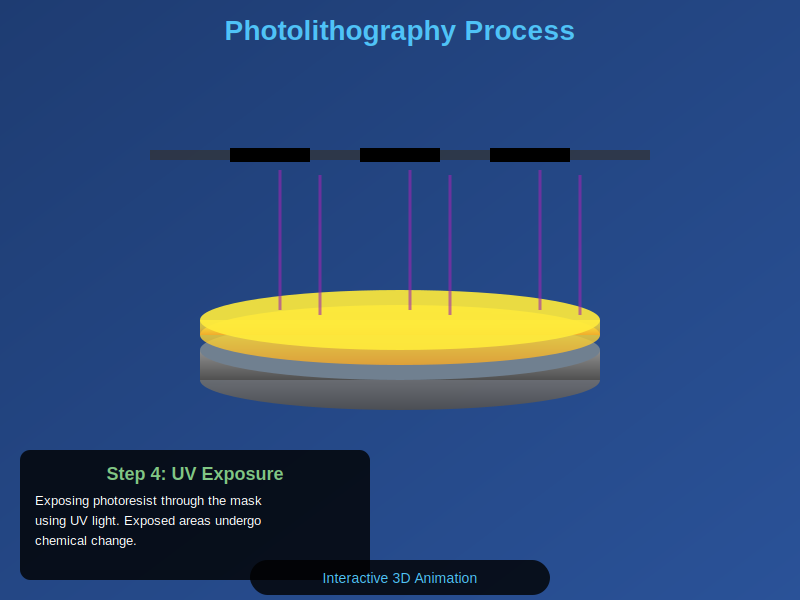
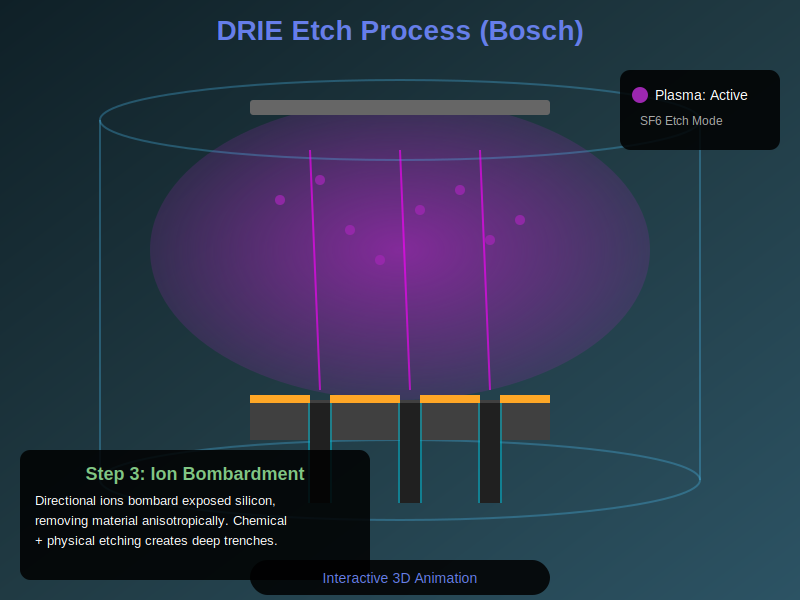
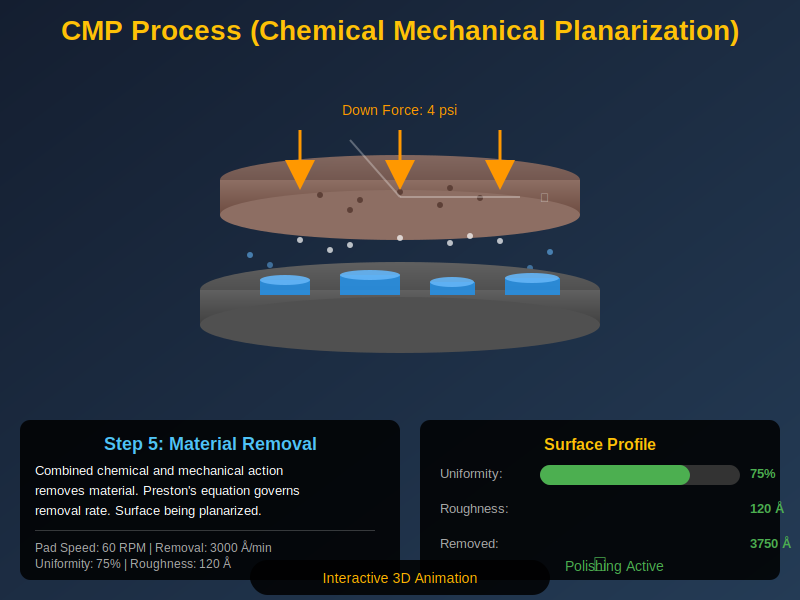

# Silicon Fabrication Process Animations

This directory contains interactive 3D animations demonstrating key silicon fabrication processes. Each animation is built using Three.js and runs directly in web browsers without requiring any additional software.

## Available Animations

### 1. Lithography Process
**File:** `lithography-process.html`  
**Duration:** 6 steps, ~18 seconds in auto-play mode



Photolithography pattern transfer using UV light through a photomask. Shows photoresist coating, exposure, and development.

---

### 2. DRIE Etch (Bosch Process)
**File:** `drie-etch.html`  
**Duration:** 6 steps, ~21 seconds in auto-play mode



Deep Reactive Ion Etching with alternating SF6 etch and C4F8 passivation cycles. Demonstrates plasma generation, ion bombardment, and high aspect ratio trench formation.

---

### 3. Wafer Bonding
**File:** `wafer-bonding.html`  
**Duration:** 7 steps, ~28 seconds in auto-play mode



Fusion bonding of silicon wafers including surface preparation, plasma activation, precision alignment, and high-temperature annealing (800-1100°C).

---

### 4. CMP Process
**File:** `cmp-process.html`  
**Duration:** 8 steps, ~28 seconds in auto-play mode



Chemical Mechanical Planarization showing slurry flow, pad rotation, and surface smoothing. Real-time metrics display uniformity improvement from 45% to 95%.

---

## 🎮 How to Use

**Opening the Animations:**
- Simply open any `.html` file in a modern web browser (Chrome, Firefox, Safari, Edge)
- No installation required - these are standalone files
- WebGL support recommended for best performance

**Controls:**
- **← Previous** / **Next →**: Navigate between steps
- **Play/Pause**: Auto-play through all steps
- **Reset**: Return to initial state

**Interactive Features:**
- Auto-rotating 3D camera view
- Step-by-step progress bar
- Real-time technical parameters (temperature, pressure, plasma status, etc.)
- Info panel with detailed descriptions

---

## 💻 Technical Details

**Technology:** Three.js r128 + Pure JavaScript + WebGL  
**Browser Support:** Chrome 90+, Firefox 88+, Safari 14+, Edge 90+  
**Performance:** 60 FPS with optimized particle systems

---

## 📚 Educational Use

Perfect for:
- Semiconductor engineering courses
- Research presentations
- Industry training programs
- Self-study and learning

---

## 📁 File Structure
```
visualization/animations/
├── README.md                       # This file
├── lithography-process.html        # 6 steps, UV lithography
├── drie-etch.html                  # 6 steps, Bosch process
├── wafer-bonding.html              # 7 steps, fusion bonding
├── cmp-process.html                # 8 steps, planarization
├── preview-lithography.svg         # Preview image
├── preview-drie.svg                # Preview image
├── preview-bonding.svg             # Preview image
└── preview-cmp.svg                 # Preview image
```

---

**Note:** These interactive HTML animations offer superior educational value compared to static videos. Users can pause, examine, and interact with each fabrication step at their own pace.
